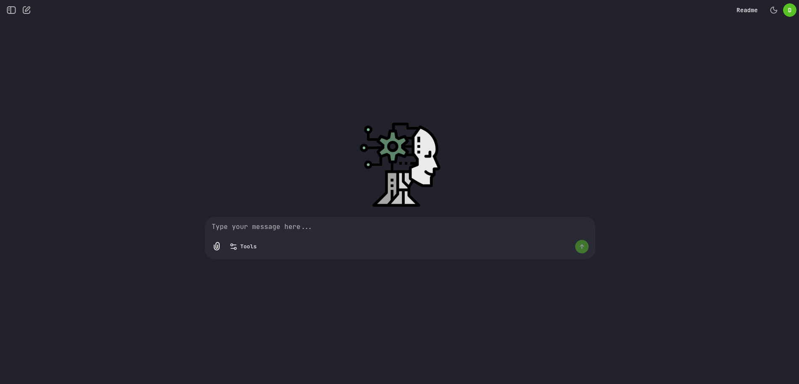

<div align="center">

# 🧠 Aria

**Your local AI assistant with a unified tool-driven architecture**

[](https://www.python.org/downloads/)
[](LICENSE)
[](https://github.com/astral-sh/ruff)

*Run a local AI assistant with a web UI, CLI, and desktop GUI*

</div>

<div align="center">

</div>

---

## ✨ Features

| | Feature | Description |
|:--|:--------|:------------|
| 🎯 | **Unified Tool Architecture** | 6 categories, 25 tools managed by a centralized registry |
| 🖥️ | **Multiple Interfaces** | Web UI, CLI, and native PySide6 desktop GUI |
| 🤖 | **Local LLM Support** | Run models locally with vLLM (GPU-accelerated inference with GPTQ/AWQ quantization) |
| 🌐 | **Browser Automation** | Lightpanda headless browser with CDP/Playwright support |
| 🔒 | **Privacy First** | Your data stays on your machine |
| 🌐 | **Web Research** | Search, weather, finance, and more |
| 💻 | **Code Execution** | Safe Python sandbox and shell commands |
| 📊 | **Knowledge & Planning** | Persistent knowledge store, structured reasoning, task planning |
| 👷 | **Worker Agents** | Background workers for heavy tasks (research, code generation, analysis) |
| 🔧 | **CLI Tool Commands** | Domain-specific CLI commands for search, finance, IMDb, and more |
| 🔬 | **Model Fine-Tuning** | LoRA/QLoRA fine-tuning with CLI-driven workflows |

---

## 🚀 Quick Start

```bash
# Clone and install
git clone git@github.com:malvavisc0/aria.git
cd aria
uv sync

# Start the server
aria server run

# Open http://localhost:8000 in your browser
```

<details>
<summary>📦 Install with GUI support</summary>

```bash
uv sync --extra gui
aria-gui  # Launch desktop application
```

</details>

---

## 🤖 Agent System

Aria uses a **tool-first architecture** centered around one primary agent with a centralized tool registry. Tools are organized into always-loaded core capabilities and on-demand domain tools that load when needed. Heavy tasks are delegated to background **worker agents**.

### How It Works

```
User Request → Aria → Registry-selected tools → Response
                ↓ (heavy tasks)
            Worker Agent → Background execution → Result file
```

Aria evaluates each request, keeps core capabilities available by default, and pulls in domain-specific tools only when the task requires them. Tasks requiring 5+ tool calls are automatically delegated to worker agents that run in the background.

---

## 🛠️ Tools

Tools are organized into **6 categories** (25 tools) managed by a centralized registry. Core and file tools are always available; domain tools load on demand.

| Category | Loading | Tools |
|:---------|:--------|:------|
| 🧠 **Core** | Always | reasoning, plan, scratchpad, shell |
| 📁 **Files** | Always | read_file, write_file, edit_file, file_info, list_files, search_files, copy_file |
| 🌍 **Browser** | On-demand | open_url, browser_click |
| 🐍 **Development** | On-demand | python |
| 📊 **Finance** | On-demand | fetch_current_stock_price, fetch_company_information, fetch_ticker_news |
| 🎬 **Entertainment** | On-demand | search_imdb_titles, get_movie_details, get_person_details, get_person_filmography, get_all_series_episodes, get_movie_reviews, get_movie_trivia, get_youtube_video_transcription |
| 🖥️ **System** | On-demand | http_request, process |

Domain tools are also accessible via CLI commands (e.g., `aria search web`, `aria finance stock`, `aria imdb search`).

For the full inventory with parameter reference, see [`docs/tools-inventory.md`](docs/tools-inventory.md).

---

## 📦 Installation

### Prerequisites

- **GPU with 8 GB+ VRAM** (minimum; 12 GB+ recommended)
- **16 GB+ system RAM**
- Python 3.12 or higher
- `uv` package manager (recommended)
- Git

> See [`docs/memory-requirements.md`](docs/memory-requirements.md) for detailed VRAM/RAM breakdown per model.

### Install

```bash
# Clone the repository
git clone git@github.com:malvavisc0/aria.git
cd aria

# Install dependencies
uv sync

# Or with GUI support
uv sync --extra gui
```

### First Run

On first launch, Aria automatically:
- Creates `.env` configuration with generated auth secrets
- Sets up the SQLite database
- Creates required directories

```bash
aria check       # Verify installation
aria server run  # Start the web server
```

---

## 💻 CLI Commands

```bash
# Server management
aria server run       # Run in foreground
aria server start     # Start in background
aria server stop      # Stop the server
aria server status    # Check status

# Inference engine
aria vllm install         # Install vLLM with auto-detected hardware target
aria vllm status          # Check vLLM installation status and version
aria vllm info            # Show vLLM configuration details

# Browser
aria lightpanda download  # Download Lightpanda headless browser
aria lightpanda status    # Check Lightpanda installation

# Model management
aria models download      # Download a model from Hugging Face
aria models list          # List downloaded models
aria models memory        # Show model memory requirements

# User management
aria users list           # List users
aria users add            # Add new user
aria users reset-password # Reset user password
aria users update         # Update user details
aria users delete         # Delete a user

# System info
aria system info          # Full system overview
aria system gpu           # GPU information
aria system vram          # VRAM details
aria system context       # Calculate max context size

# Configuration
aria config show          # Show current config
aria config paths         # Show configured paths
aria config database      # Show database info
aria config api           # Show API endpoints

# Health check
aria check                # Verify installation and connectivity

# Agent tool commands (CLI access to domain tools)
aria search web "query"         # Web search
aria search fetch "url"         # Fetch URL content (auto-detects file vs website)
aria search weather "city"      # Weather forecast
aria search youtube "url"       # YouTube transcript
aria knowledge store "key" "v"  # Store a fact
aria knowledge recall "key"     # Retrieve a fact
aria knowledge search "query"   # Search stored facts
aria finance stock TICKER       # Stock price
aria finance company TICKER     # Company info
aria finance news TICKER        # Recent news
aria imdb search "title"        # Search movies/TV
aria imdb movie ID              # Movie details
aria web click "selector"       # Click browser element
aria dev run "code"             # Execute Python code
aria http request GET "url"     # HTTP request
aria system hardware            # System hardware info
aria worker spawn --prompt "..." # Launch background worker
aria worker list                # List workers
aria self test-tools            # Verify tool loading
```

---

## 🖥️ GUI Application

```bash
aria-gui    # Launch desktop application (requires: uv sync --extra gui)
```

The native PySide6 desktop GUI provides:

| Tab | Features |
|:----|:---------|
| **Overview** | System status, database info, API endpoints, debug log viewer |
| **Setup** | Install vLLM, download models from Hugging Face, and manage Lightpanda browser — with real-time output and cancel support |
| **Users** | Create, edit, delete users with password strength validation |
| **Settings** | Configure model paths, API URLs, and service parameters |
| **Logs** | View application logs with search, level filtering, and auto-refresh |

Additional features:
- **System tray** — minimizes to tray on close; force-quit via menu or Ctrl+Q
- **First-run wizard** — guided setup on first launch
- **Responsive layout** — adapts to window size
- **Preflight checks** — validates configuration on tab switch

---

## 🌐 Web UI

After starting the server, access the web interface at `http://localhost:8000`

The web UI is powered by [Chainlit](https://github.com/Chainlit/chainlit) and provides a chat interface to interact with Aria.

---

## ⚙️ Configuration

Aria uses environment variables stored in `.env`:

```bash
# Core settings
DATA_FOLDER=./data
CHAINLIT_AUTH_SECRET=<auto-generated>

# Chat model (served by vLLM)
CHAT_MODEL = Granite-4.1-8B
CHAT_MODEL_PATH = ethanhunt3/Granite-4.1-8B-GPTQ-INT4
CHAT_CONTEXT_SIZE = 32768

# Embeddings model (loaded in-process via HuggingFace)
EMBEDDINGS_MODEL = granite-embedding-311m-multilingual-r2
EMBED_MODEL_PATH = ibm-granite/granite-embedding-311m-multilingual-r2

# vLLM engine
ARIA_VLLM_QUANT = gptq_marlin
ARIA_VLLM_GPU_MEMORY_UTILIZATION = 0.85
```

<details>
<summary>📁 Directory Structure</summary>

```
aria/
├── data/                  # Data root
│   ├── aria.db            # SQLite database
│   └── bin/
│       └── lightpanda/    # Lightpanda headless browser binary
├── storage/               # Uploaded files
├── chromadb/              # Vector database
└── .env                   # Configuration
```

</details>

---

## 🤝 Contributing

Contributions are welcome! Please feel free to submit issues and pull requests.

### Development Setup

```bash
# Install dev dependencies
uv sync --group dev

# Run tests
uv run pytest

# Lint and format code
uv run ruff check src/
uv run ruff format src/
```

---

## 📄 License

This project is licensed under the MIT License - see the [LICENSE](LICENSE) file for details.

---

<div align="center">

**Made with ❤️ by malvavisc0**

[Report Bug](https://github.com/malvavisc0/aria/issues) · [Request Feature](https://github.com/malvavisc0/aria/issues)

</div>