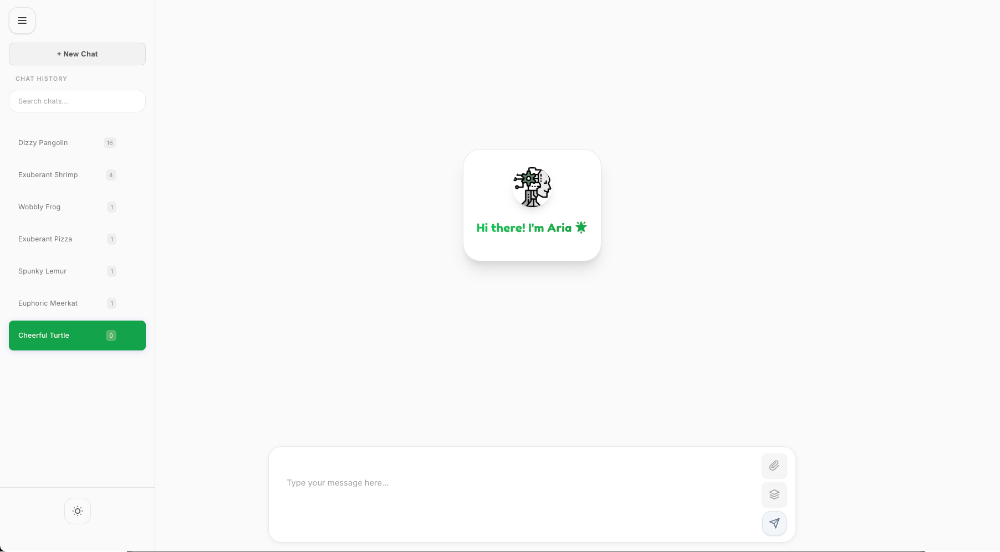

# Aria - AI Agent Platform

Aria is a comprehensive platform that delivers a suite of **AI Agents** through a user-friendly web interface. It combines powerful AI capabilities with an intuitive UI, making sophisticated AI accessible without requiring extensive technical expertise.



## Introduction

Aria's primary purpose is to provide a **cost-effective way to run AI agents locally** for reasoning and task completion. It's designed for AI enthusiasts with some technical experience (e.g., familiarity with Docker and GPU acceleration) who want to avoid expensive API costs while still leveraging powerful AI capabilities.

The platform uses the [Agno framework](https://github.com/agno-agi/agno) to enable agents with memory, logic, and reasoning capabilities. Each agent is assigned specific tasks, goals, and instructions. This design allows for efficient operation with smaller parameter models (8B), eliminating the need for larger, more resource-intensive models.

## Features

- **Multiple specialized AI agents** for different tasks
- **Local execution** of AI models using Ollama
- **Knowledge base integration** for document processing
- **Memory and context retention** across conversations
- **Web-based user interface** built with Chainlit
- **Docker-based deployment** for easy setup
- **Authentication** with username/password or Google OAuth

## Installation

### Prerequisites

- Docker and Docker Compose
- GPU with CUDA support (recommended for better performance)
- Ollama installed and running (for local model execution)

### Setup

1. Clone the repository:
   ```bash
   git clone https://github.com/yourusername/aria.git
   cd aria
   ```

2. Configure the environment variables:
   ```bash
   cp env.txt .env
   ```
   Edit the `.env` file to set your configuration options (see Configuration section below).

3. Start the services:
   ```bash
   docker-compose up -d
   ```

4. Access the web interface at `http://localhost:9000` (or the URL specified in your configuration).

## Configuration

The following environment variables can be configured in the `.env` file:

| Variable | Description | Default |
|----------|-------------|---------|
| `OLLAMA_URL` | URL of your Ollama instance | `http://localhost:11434` |
| `CHATBOT_MODEL` | Model to use for chat interactions | `doomgrave/gemma3-tools:latest` |
| `TOOL_MODEL` | Model to use for tool operations | `doomgrave/gemma3-tools:latest` |
| `VISION_MODEL` | Model to use for image processing | `doomgrave/gemma3-tools:latest` |
| `EMBEDDING_MODEL` | Model to use for embeddings | `granite-embedding:278m` |
| `AUTH_LOGIN_USERNAME` | Username for basic authentication | `david` |
| `AUTH_LOGIN_PASSWORD` | Password for basic authentication | `admin00` |
| `CHAINLIT_URL` | URL where the application is hosted | `http://localhost:9000` |
| `TZ` | Timezone for the application | `Europe/Berlin` |

For advanced configuration options, refer to the `.env` file comments.

## Usage

1. Log in to the web interface using the configured credentials.
2. Select an agent from the sidebar based on your needs.
3. Enter your query or upload relevant files.
4. Receive AI-generated responses based on the selected agent's capabilities.

## Available Agents

### 📚 Chat Agent 

Excels at natural language conversation. Designed for interactive dialogue, question answering, and general chat interactions. Ideal for getting quick answers to questions and simulating a conversation with an AI. Useful for iteratively refining ideas.

### 🐬 Reasoning Agent 

Built for logical reasoning and problem-solving. Can analyze information, draw conclusions, and identify potential solutions. Great for brainstorming, complex decision-making, troubleshooting issues, and exploring different scenarios. Useful for evaluating the pros and cons of different approaches.

### 💸 Finance Agent

Accesses real-time and historical stock prices, financial news, and key financial data points for a wide range of assets (stocks, ETFs, mutual funds, cryptocurrencies, etc.). Provides insights and analysis on financial markets.

### 🔍 Wikipedia Agent

Specifically designed to search and retrieve information from Wikipedia. Quickly gathers background information, verifies facts, and expands your knowledge base on a wide range of topics.

### 👨‍⚕️ Medic Agent 

Focused on searching and extracting data from the [PubMed database](https://pubmed.ncbi.nlm.nih.gov/), a comprehensive resource for biomedical literature. Essential for researchers and anyone working with medical or scientific topics. Quickly finds relevant research papers, clinical trials, and other resources.

### 🚀 arXiv Agent

Dedicated to searching and retrieving information from [arXiv](https://arxiv.org/), a repository for pre-prints in physics, mathematics, computer science, and related fields. Helps you stay up-to-date on the latest research, discover new approaches, and find inspiration for your own projects.

### 🌐 Researcher Agent

This agent orchestrates other agents, leveraging their combined strengths to perform comprehensive research tasks. It can formulate search queries, gather information from multiple sources, and synthesize findings into a coherent report. Ideal for complex research projects requiring a broad perspective and synthesis of information from diverse sources.

## Architecture

Aria is built using a microservices architecture with the following components:

- **aria**: The main application container running the Chainlit web UI
- **postgres**: PostgreSQL database for storing conversation history and user data
- **redis**: Redis database for caching and memory storage
- **prisma**: Database ORM for managing database migrations and queries
- **localstack**: AWS service emulator for S3 storage
- **searxng**: Metasearch engine for web searches
- **dozzle**: Docker container log viewer
- **app**: Nginx proxy manager for handling HTTP/HTTPS traffic
- **byparr**: Additional service for specific functionality

## Development

### Project Structure

- `src/`: Main application code
  - `assistant/`: Agent implementation
    - `agents/`: Individual agent implementations
    - `steps.py`: Agent execution steps
  - `webui.py`: Web UI implementation using Chainlit
  - `commands.py`: Command definitions for the UI
- `prisma/`: Database schema and migrations
- `searxng/`: SearXNG configuration
- `dozzle/`: Dozzle configuration

### Adding a New Agent

1. Define the agent's settings in `src/assistant/agents/settings/`
2. Implement the agent's tools in `src/assistant/agents/tools/`
3. Add the agent to the commands list in `src/commands.py`

## Contributing

Contributions are welcome! Please feel free to submit a Pull Request.

1. Fork the repository
2. Create your feature branch (`git checkout -b feature/amazing-feature`)
3. Commit your changes (`git commit -m 'Add some amazing feature'`)
4. Push to the branch (`git push origin feature/amazing-feature`)
5. Open a Pull Request

## License

This project is licensed under the MIT License - see the LICENSE file for details.

## Acknowledgements

- [Agno](https://github.com/agno-agi/agno) - AI agent framework
- [Chainlit](https://github.com/Chainlit/chainlit) - Web UI framework
- [Ollama](https://github.com/ollama/ollama) - Local model execution
- [SearXNG](https://github.com/searxng/searxng) - Metasearch engine
