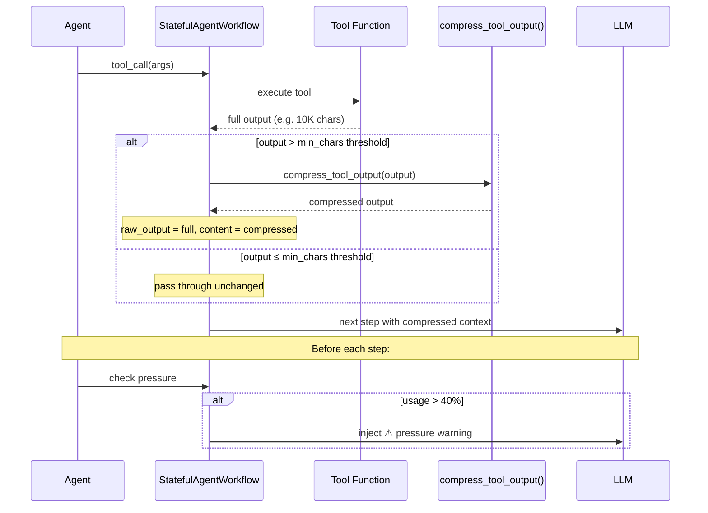

# Tool Output Compression & Context Management

## Overview

Aria uses two complementary mechanisms to keep the LLM context window from
overflowing during long chat sessions:

1. **Tool output compression** — deterministic, lossy truncation of large tool
   results before they enter the agent context.
2. **Context pressure monitoring** — a safety net that warns the agent when the
   cumulative context approaches the context limit.

Together these allow 3–5× more tool calls per turn and significantly more
conversation turns before hitting `context_length_exceeded` errors.

---

## Why Compression Is Needed

Every LLM call sends the full conversation context. During a single agent turn,
tool calls accumulate in the **scratchpad** — the space between the system
prompt and the output reservation.

```
┌─────────────────────────────────────────────────────────┐
│                    CONTEXT WINDOW                        │
│                                                         │
│  ┌─────────────┐ ┌──────────┐ ┌──────────────────────┐ │
│  │   System     │ │  Memory  │ │     Scratchpad       │ │
│  │   Prompt     │ │ (recent  │ │  (tool calls within  │ │
│  │   + Tools    │ │  history │ │   a single agent     │ │
│  │   ~6k tok    │ │  + mem   │ │   turn — accumulates │ │
│  │              │ │  blocks) │ │   tool results)      │ │
│  └─────────────┘ └──────────┘ └──────────────────────┘ │
│                                                         │
│  ┌─────────────────────────────────────────────────────┐│
│  │              Output Reservation (max_tokens)         ││
│  │                    12,288 tokens                     ││
│  └─────────────────────────────────────────────────────┘│
└─────────────────────────────────────────────────────────┘
```

Without compression, a tool call returning 8K characters (~2K tokens) fills
the scratchpad quickly. With 30 tool calls in a turn:

| Scenario | Scratchpad tokens |
|---|---|
| Without compression | 30 × 2,000 = **60,000** |
| With compression | 30 × 500 = **15,000** |

That is a **75% reduction** in scratchpad usage.

---

## Mechanism 1: Tool Output Compression

### Where It Lives

- **Implementation**: `src/aria/llm/_compress.py`
- **Wired into**: `src/aria/llm/_state.py` → `StatefulAgentWorkflow.call_tool()`

### How It Works

After every successful tool call, the output passes through
`compress_tool_output()`:

```
Tool runs → returns full output (e.g. 10,000 chars)
    ↓
compress_tool_output() applies size-based rules
    ↓
Compressed version injected into agent context (e.g. 2,300 chars)
    ↓
Full original kept in raw_output for logging/diagnostics
```

Only **successful** outputs are compressed. Error results pass through
unchanged so the agent sees the full error message.

### Compression Thresholds

All thresholds are computed as **fractions of the context window** so they
scale correctly across hardware profiles (32K, 131K, 262K, etc.):

| Output size | Mode | Head kept | Tail kept | Notice |
|---|---|---|---|---|
| < 0.5% of context | **None** | all | all | — |
| 0.5%–2.5% of context | **Medium** | 0.5% of ctx | 0.2% of ctx | `[...compressed — dropped N chars…]` |
| > 2.5% of context | **Aggressive** | 0.2% of ctx | 0.1% of ctx | `[...heavily compressed — dropped N chars…]` |

**Example thresholds at different context sizes:**

| Context | min_chars | max_chars | head_chars | tail_chars |
|---|---|---|---|---|
| 32K tokens | 655 | 3,276 | 655 | 262 |
| 131K tokens | 2,621 | 13,107 | 2,621 | 1,048 |
| 262K tokens | 5,242 | 26,214 | 5,242 | 2,097 |

Absolute char overrides are also available if you need fixed limits
regardless of context size (see [Configuration](#configuration)).

### The Compression Notice

When output is compressed, a notice is appended:

```
[...compressed — dropped 5,200 chars from middle.
 Original: 8,000 chars.
 Use offset/length or max_results for smaller chunks.]
```

This tells the agent that data was dropped and how to request smaller
chunks if needed. The agent can then use `offset`/`length` on file reads
or `max_results` on searches to retrieve the missing data.

### Raw Before/After Examples

#### Example 1: File read (3,500 chars → 1,800 chars)

**BEFORE** (full tool output — 3,500 chars, ~875 tokens):

```json
{
  "status": "success",
  "tool": "read_file",
  "reason": "Check server configuration",
  "timestamp": "2026-05-10T09:00:00Z",
  "data": {
    "file_name": "src/aria/server/vllm.py",
    "content": "class VLLMServerManager:\n    \"\"\"Manages the vLLM inference server lifecycle.\"\"\"\n\n    DEFAULT_PORT = 9090\n    DEFAULT_TIMEOUT = 120\n\n    def __init__(self):\n        self._process = None\n        self._port = self.DEFAULT_PORT\n        self._host = \"localhost\"\n        self._started_at = None\n        self._model = None\n        self._quantization = None\n        self._gpu_memory_utilization = None\n        self._kv_cache_dtype = None\n        self._tp_size = 1\n        self._tool_call_parser = None\n        self._reasoning_parser = None\n        self._chat_template_kwargs = None\n        self._max_model_len = None\n        self._api_key = None\n        # ... hundreds more lines of server initialization,\n        # health checks, process management, GPU detection,\n        # model loading, configuration validation, etc.",
    "total_lines": 412,
    "mode": "full"
  }
}
```

**AFTER** (compressed — 1,800 chars, ~450 tokens):

```json
{
  "status": "success",
  "tool": "read_file",
  "reason": "Check server configuration",
  "timestamp": "2026-05-10T09:00:00Z",
  "data": {
    "file_name": "src/aria/server/vllm.py",
    "content": "class VLLMServerManager:\n    \"\"\"Manages the vLLM inference server lifecycle.\"\"\"\n\n    DEFAULT_PORT = 9090\n    DEFAULT_TIMEOUT = 120\n\n    def __init__(self):\n        self._process = None\n        self._port = self.DEFAULT_PORT\n        self._host = \"localhost\"\n        self._started_at = None\n        self._model = None\n        self._quantization = None\n        self._gpu_memory_utilization = None\n        self._kv_cache_dtype = None\n        self._tp_size = 1\n        self._tool_call_parser = None\n        self._reasoning_parser = None\n        self._chat_template_kwargs = None\n        self._max_model_len = None\n        self._api_key = None",
    "total_lines": 412,
    "mode": "full"
  }
}

[...compressed — dropped 1,700 chars from middle. Original: 3,500 chars. Use offset/length or max_results for smaller chunks.]
```

**Savings: ~425 tokens (48% reduction)**

#### Example 2: Web search results (12,000 chars → 2,100 chars)

**BEFORE** (10 search results with full snippets — 12,000 chars, ~3,000 tokens):

```json
{
  "status": "success",
  "tool": "web_search",
  "reason": "Find Python async patterns",
  "data": {
    "results": [
      {"title": "Async Python — Real Python", "href": "https://realpython.com/async-python/", "snippet": "Python's asyncio library provides tools for writing concurrent code..."},
      {"title": "Mastering Async/Await — Towards DS", "href": "https://towardsdatascience.com/...", "snippet": "A deep dive into Python's async/await paradigm..."},
      {"title": "Python asyncio docs", "href": "https://docs.python.org/3/library/asyncio.html", "snippet": "The asyncio library provides infrastructure..."},
      {"title": "Async best practices", "href": "...", "snippet": "..."},
      {"title": "Concurrency in Python", "href": "...", "snippet": "..."},
      {"title": "Event loop deep dive", "href": "...", "snippet": "..."},
      {"title": "Async patterns cookbook", "href": "...", "snippet": "..."},
      {"title": "Real-world asyncio", "href": "...", "snippet": "..."},
      {"title": "Performance with async", "href": "...", "snippet": "..."},
      {"title": "Advanced async patterns", "href": "...", "snippet": "..."}
    ]
  }
}
```

**AFTER** (2 results preserved — 2,100 chars, ~525 tokens):

```json
{
  "status": "success",
  "tool": "web_search",
  "reason": "Find Python async patterns",
  "data": {
    "results": [
      {"title": "Async Python — Real Python", "href": "https://realpython.com/async-python/", "snippet": "Python's asyncio library provides tools for writing concurrent code..."},
      {"title": "Mastering Async/Await — Towards DS", "href": "https://towardsdatascience.com/...", "snippet": "A deep dive into Python's async/await paradigm..."}
    ]
  }
}

[...heavily compressed — dropped 9,900 chars. Original: 12,000 chars. Use offset/length or max_results for smaller chunks.]
```

**Savings: ~2,475 tokens (82% reduction)**

#### Example 3: No compression (small output)

Small outputs pass through unchanged. On a 32K context, the minimum
threshold is 655 chars (0.5% of context):

```json
{
  "status": "success",
  "tool": "file_info",
  "reason": "Check file size",
  "data": {
    "exists": true,
    "is_file": true,
    "size": 12847,
    "modified": "2026-05-09T14:30:00Z",
    "mime_type": "text/x-python"
  }
}
```

This is ~350 chars — under the 655-char minimum on 32K context — so no
compression occurs.

### Impact Across a Full Turn

With 20 tool calls in a single agent turn:

| Tool call type | Before | After |
|---|---|---|
| 5× small (file_info, weather) | 5 × 500 = 2,500 | 5 × 500 = 2,500 (unchanged) |
| 8× medium (read_file, search) | 8 × 2,000 = 16,000 | 8 × 500 = 4,000 |
| 4× large (web_search, shell) | 4 × 3,000 = 12,000 | 4 × 750 = 3,000 |
| 3× huge (full file dump) | 3 × 5,000 = 15,000 | 3 × 1,000 = 3,000 |
| **Total scratchpad** | **45,500 tokens** | **12,500 tokens** |
| **Savings** | | **33,000 tokens (72%)** |

---

## Mechanism 2: Context Pressure Monitoring

### Where It Lives

- **Implementation**: `src/aria/llm/_state.py` →
  `StatefulAgentWorkflow._inject_pressure_warning()`

### How It Works

Before each agent step (each time the LLM is called), the workflow estimates
total token usage by summing all message content lengths and dividing by 4
(approximate chars-per-token ratio):

```python
approx_tokens = sum(len(str(m.content or "")) // 4 for m in ev.input)
usage_ratio = approx_tokens / context_size
```

When usage exceeds the pressure threshold (default: 40%), a system message
is injected into the conversation:

```
⚠ Context is 42% full (110,000/262,144 tokens).
Consolidate findings and produce a final answer now.
```

This tells the agent to stop making tool calls and produce its final response
before it runs out of context.

### Why 40%?

The threshold is deliberately conservative because:

1. The next LLM call will add the assistant's response (~12K tokens reserved)
2. Tool outputs from the current step haven't been counted yet
3. It gives the agent room to produce a comprehensive final answer

The threshold is configurable via `ARIA_SCRATCHPAD_PRESSURE_THRESHOLD`.

---

## Configuration

All thresholds are tunable via environment variables. **Ratio-based**
variables (default) compute limits as fractions of `CHAT_CONTEXT_SIZE`.
**Absolute** variables override the ratios with fixed char counts.

### Ratio-based (default — recommended)

| Variable | Default | Description |
|---|---|---|
| `ARIA_COMPRESS_MIN_RATIO` | `0.005` | 0.5% — below this: no compression |
| `ARIA_COMPRESS_MAX_RATIO` | `0.025` | 2.5% — above this: aggressive compression |
| `ARIA_COMPRESS_HEAD_RATIO` | `0.005` | 0.5% — head to keep (medium) |
| `ARIA_COMPRESS_TAIL_RATIO` | `0.002` | 0.2% — tail to keep (medium) |
| `ARIA_COMPRESS_AGGRESSIVE_HEAD_RATIO` | `0.002` | 0.2% — head to keep (aggressive) |
| `ARIA_COMPRESS_AGGRESSIVE_TAIL_RATIO` | `0.001` | 0.1% — tail to keep (aggressive) |
| `ARIA_SCRATCHPAD_PRESSURE_THRESHOLD` | `0.40` | Context pressure warning threshold |

### Absolute overrides (take precedence over ratios)

| Variable | Description |
|---|---|
| `ARIA_COMPRESS_MIN_CHARS` | Fixed min chars regardless of context size |
| `ARIA_COMPRESS_MAX_CHARS` | Fixed max chars regardless of context size |
| `ARIA_COMPRESS_HEAD_CHARS` | Fixed head chars |
| `ARIA_COMPRESS_TAIL_CHARS` | Fixed tail chars |
| `ARIA_COMPRESS_AGGRESSIVE_HEAD` | Fixed aggressive head chars |
| `ARIA_COMPRESS_AGGRESSIVE_TAIL` | Fixed aggressive tail chars |

### Why ratio-based?

Absolute thresholds break across hardware profiles. A 2,000-char min
threshold is reasonable on 32K context (1.5%) but far too aggressive on
262K context (0.2%). Ratio-based thresholds scale automatically:

```bash
# Default ratios work for all context sizes — no tuning needed
# A 32K context compresses at 655 chars, 262K at 5,242 chars
```

### Tuning examples

**Very long sessions** — increase pressure sensitivity:

```bash
ARIA_SCRATCHPAD_PRESSURE_THRESHOLD=0.30
```

**Force fixed limits** — override ratios with absolute values:

```bash
ARIA_COMPRESS_MIN_CHARS=1000
ARIA_COMPRESS_MAX_CHARS=4000
```

---

## Architecture



---

## Implementation Details

### Module: `src/aria/llm/_compress.py`

- `compress_tool_output(output, tool_name)` — main compression function
- Ratio thresholds loaded from env vars at import time; absolute overrides read at runtime
- Deterministic — same input always produces same output (no LLM call needed)
- Preserves the beginning and end of outputs (most relevant data)
- Appends a notice so the agent knows data was dropped

### Module: `src/aria/llm/_state.py`

- `StatefulAgentWorkflow.call_tool()` — applies compression after tool execution
- `StatefulAgentWorkflow._inject_pressure_warning()` — checks context usage
- `StatefulAgentWorkflow.run_agent_step()` — calls pressure check before each step

### Integration Point

Compression is applied in `call_tool()` between the tool execution and the
state reduction:

```python
async def call_tool(self, ctx, ev):
    result = await super().call_tool(ctx, ev)

    # Compress successful tool outputs
    output = result.tool_output
    if not output.is_error:
        raw_content = str(getattr(output, "content", ""))
        compressed = compress_tool_output(raw_content, ev.tool_name)
        if compressed is not raw_content:
            output.raw_output = raw_content   # full output for diagnostics
            output.content = compressed       # LLM sees compressed version

    await self.reduce_state(ctx, result)
    return result
```

---

## Testing

The compression module has 24 tests covering:

- Empty strings
- Below-threshold pass-through
- Medium and aggressive compression
- Head + tail preservation
- Compression notice content
- Overlap guard (no negative "dropped" counts)
- Context-size scaling (32K, 131K, 262K)
- Ratio-based env var overrides
- Absolute env var overrides
- Scratchpad pressure threshold defaults and overrides

Run tests:

```bash
uv run pytest src/aria/llm/tests/test_compress.py -v
```

---

## Related Documents

- [Token Budget & VRAM Configuration Guide](token-budget-guide.md) — how the
  context window is allocated
- [Model Memory Requirements](memory-requirements.md) — GPU VRAM and KV cache
- [CLI Chat Business Logic Plan](plan-cli-chat-logic.md) — planned `/compact`
  command for manual context compression