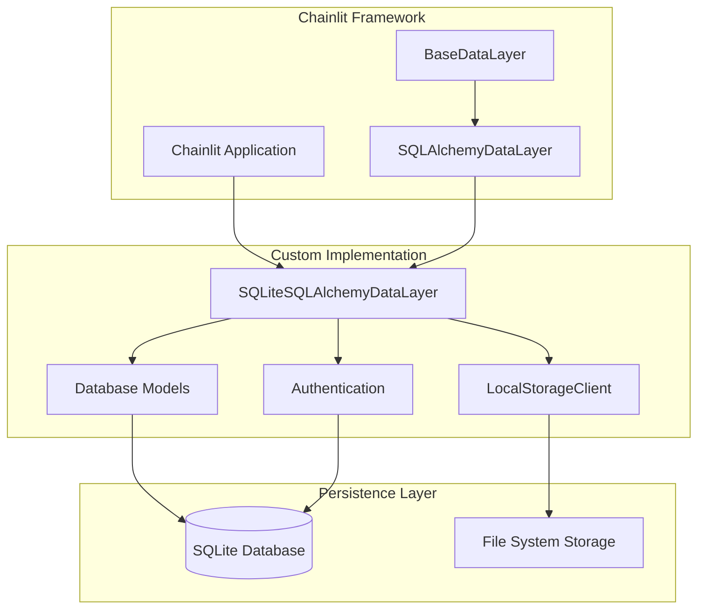
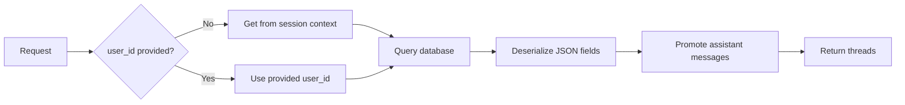
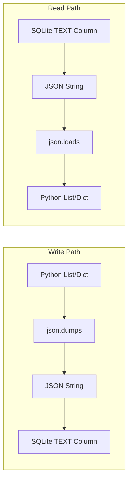

# Custom Data Layer Documentation

## Overview

This document provides comprehensive documentation for the custom data layer implementation in the Aria project. The implementation extends Chainlit's data persistence framework to support SQLite with proper JSON serialization, local file storage, and password-based authentication.

## Architecture

The custom data layer consists of three main components:

1. **SQLiteSQLAlchemyDataLayer** - Custom data layer extending Chainlit's SQLAlchemyDataLayer
2. **LocalStorageClient** - Local filesystem storage for Chainlit elements
3. **Database Models** - SQLAlchemy models for SQLite persistence



## Component Details

### 1. SQLiteSQLAlchemyDataLayer

**Location:** [`src/aria/db/layer.py`](../src/aria/db/layer.py)

#### Purpose

The `SQLiteSQLAlchemyDataLayer` class extends Chainlit's `SQLAlchemyDataLayer` to provide SQLite compatibility. Chainlit's built-in data layer expects PostgreSQL-style `TEXT[]` arrays for tags, which are incompatible with SQLite. This custom implementation fixes these compatibility issues through JSON serialization.

#### Key Features

1. **JSON Serialization for Tags**
   - Converts Python `list[str]` to JSON strings for storage
   - Deserializes JSON strings back to `list[str]` on retrieval
   - Handles tags in threads, steps, and other entities

2. **JSON Field Normalization**
   - Normalizes `metadata`, `generation`, and `props` fields
   - Ensures consistent JSON serialization/deserialization
   - Handles malformed JSON gracefully with fallback defaults

3. **Multi-User Support**
   - Automatically filters threads by user context
   - Retrieves user_id from Chainlit session when available
   - Ensures users only see their own threads

4. **Assistant Message Promotion**
   - Promotes assistant messages to root level for thread display
   - Fixes issue where messages created in workflow context don't appear in history
   - Clears `parentId` on read for assistant messages

#### Core Methods

##### `update_thread()`

```python
async def update_thread(
    self,
    thread_id: str,
    name: Optional[str] = None,
    user_id: Optional[str] = None,
    metadata: Optional[Dict] = None,
    tags: Optional[List[str]] = None,
)
```

**Purpose:** Updates thread details with SQLite-safe tag serialization.

**Implementation Details:**
- Serializes `tags` list to JSON string before storage
- Passes serialized tags to parent class method
- Handles `None` tags appropriately

**Example:**
```python
await data_layer.update_thread(
    thread_id="thread-123",
    tags=["important", "bug", "feature"]
)
# Stored in DB as: '["important", "bug", "feature"]'
```

##### `create_step()`

```python
async def create_step(self, step_dict: StepDict)
```

**Purpose:** Creates a step with SQLite-safe JSON serialization.

**Implementation Details:**
- Patches `step_dict` to serialize tags as JSON
- Preserves all other step fields
- Ensures SQLite compatibility for TEXT columns

**Example:**
```python
await data_layer.create_step({
    "id": "step-123",
    "name": "Assistant Response",
    "type": "assistant_message",
    "tags": ["ai", "response"],
    "metadata": {"model": "gpt-4"}
})
```

##### `get_all_user_threads()`

```python
async def get_all_user_threads(
    user_id: Optional[str] = None,
    thread_id: Optional[str] = None
)
```

**Purpose:** Retrieves user threads with proper JSON deserialization and user filtering.

**Implementation Details:**
- Attempts to get user_id from Chainlit session context if not provided
- Deserializes JSON fields (tags, metadata, generation, props)
- Promotes assistant messages to root level
- Handles malformed JSON with warning logs

**Data Flow:**


##### `get_step()`

```python
async def get_step(self, step_id: str)
```

**Purpose:** Retrieves a single step with JSON deserialization.

**Implementation Details:**
- Deserializes tags, metadata, and generation fields
- Returns `None` if step not found
- Ensures consistent data format

##### `list_threads()`

```python
async def list_threads(
    pagination: Pagination,
    filters: ThreadFilter
) -> PaginatedResponse
```

**Purpose:** Lists threads with pagination and JSON deserialization.

**Implementation Details:**
- Deserializes JSON fields for all threads
- Deserializes nested steps and elements
- Promotes assistant messages to root level
- Returns paginated response

#### Helper Functions

##### `_json_dumps_or_none()`

```python
def _json_dumps_or_none(value: Any) -> Optional[str]
```

**Purpose:** Safely serializes values to JSON strings.

**Behavior:**
- Returns `None` if value is `None`
- Serializes any other value to JSON string
- Used for storing Python objects in TEXT columns

##### `_json_loads_or()`

```python
def _json_loads_or(value: Any, default: Any) -> Any
```

**Purpose:** Safely deserializes JSON strings with fallback.

**Behavior:**
- Returns default if value is `None`
- Deserializes JSON strings to Python objects
- Returns value as-is if already deserialized
- Logs warnings for malformed JSON and returns default
- Prevents data corruption from propagating

**Example:**
```python
# Deserialize tags with empty list fallback
tags = _json_loads_or(thread.get("tags"), default=[])

# Deserialize metadata with empty dict fallback
metadata = _json_loads_or(thread.get("metadata"), default={})
```

### 2. LocalStorageClient

**Location:** [`src/aria/db/local_storage_client.py`](../src/aria/db/local_storage_client.py)

#### Purpose

The `LocalStorageClient` provides local filesystem storage for Chainlit elements (images, files, etc.) as an alternative to cloud storage providers like S3, Azure, or GCS. This is ideal for development, testing, and self-hosted deployments.

#### Key Features

1. **Local File Storage**
   - Stores files in configurable local directory
   - Creates directory structure automatically
   - Supports subdirectories in object keys

2. **Async File Operations**
   - Uses `aiofiles` for non-blocking I/O
   - Compatible with Chainlit's async architecture
   - Efficient for concurrent operations

3. **Flexible URL Generation**
   - Configurable base URL for file access
   - Supports `file://` protocol for local access
   - Can use HTTP URLs if serving files via web server

4. **Overwrite Control**
   - Optional overwrite protection
   - Raises `FileExistsError` when overwrite=False
   - Prevents accidental file replacement

#### Core Methods

##### `__init__()`

```python
def __init__(
    self,
    storage_path: str = ".files/storage",
    base_url: str = "file://"
)
```

**Purpose:** Initializes the local storage client.

**Parameters:**
- `storage_path`: Directory path for storing files (default: `.files/storage`)
- `base_url`: Base URL for file access (default: `file://`)

**Behavior:**
- Creates storage directory if it doesn't exist
- Logs initialization details
- Sets up path and URL configuration

**Example:**
```python
# Development setup with file:// URLs
client = LocalStorageClient(storage_path=".files/storage")

# Production setup with HTTP URLs
client = LocalStorageClient(
    storage_path="/var/www/files",
    base_url="https://example.com/files"
)
```

##### `upload_file()`

```python
async def upload_file(
    self,
    object_key: str,
    data: Union[bytes, str],
    mime: str = "application/octet-stream",
    overwrite: bool = True,
    content_disposition: str | None = None,
) -> Dict[str, Any]
```

**Purpose:** Uploads a file to local storage.

**Parameters:**
- `object_key`: Unique identifier (can include subdirectories)
- `data`: File content as bytes or string
- `mime`: MIME type of the file
- `overwrite`: Whether to overwrite existing file
- `content_disposition`: Not used for local storage

**Returns:**
- Dictionary with `object_key` and `url`
- Empty dict on error

**Behavior:**
- Creates parent directories if needed
- Checks for existing files when overwrite=False
- Writes bytes or string data appropriately
- Generates URL for file access
- Logs upload details

**Example:**
```python
# Upload image
result = await client.upload_file(
    object_key="images/avatar.png",
    data=image_bytes,
    mime="image/png"
)
# Returns: {'object_key': 'images/avatar.png', 'url': 'file://...'}

# Upload text file
result = await client.upload_file(
    object_key="docs/readme.txt",
    data="Hello, world!",
    mime="text/plain"
)
```

##### `delete_file()`

```python
async def delete_file(self, object_key: str) -> bool
```

**Purpose:** Deletes a file from local storage.

**Parameters:**
- `object_key`: Unique identifier for the file

**Returns:**
- `True` if file was deleted
- `False` if file not found or error occurred

**Behavior:**
- Checks if file exists and is a file (not directory)
- Deletes file using `Path.unlink()`
- Logs deletion details
- Handles errors gracefully

**Example:**
```python
success = await client.delete_file("images/avatar.png")
if success:
    print("File deleted successfully")
```

##### `get_read_url()`

```python
async def get_read_url(self, object_key: str) -> str
```

**Purpose:** Gets a URL for reading a file.

**Parameters:**
- `object_key`: Unique identifier for the file

**Returns:**
- URL to access the file
- Returns object_key if file not found or error

**Behavior:**
- Checks if file exists
- Generates URL using base_url and file path
- Logs warnings for missing files
- Returns object_key as fallback

**Example:**
```python
url = await client.get_read_url("images/avatar.png")
# Returns: "file:///path/to/.files/storage/images/avatar.png"
```

##### `close()`

```python
async def close(self) -> None
```

**Purpose:** Closes the storage client.

**Behavior:**
- No-op for local storage (no connections to close)
- Logs closure for debugging
- Maintains compatibility with BaseStorageClient interface

### 3. Database Models

**Location:** [`src/aria/db/models.py`](../src/aria/db/models.py)

#### Purpose

SQLAlchemy models that define the database schema for SQLite. These models match Chainlit's expected schema but use SQLite-compatible types.

#### Key Design Decisions

1. **SQLite Type Mapping**
   - UUIDs stored as `String(36)` instead of PostgreSQL `UUID`
   - JSON fields stored as `Text` instead of `JSONB`
   - Arrays stored as `Text` (JSON strings) instead of `TEXT[]`

2. **Metadata Column Handling**
   - `metadata` is reserved by SQLAlchemy's Declarative API
   - Mapped to Python attribute `metadata_` while keeping DB column name `metadata`
   - Uses `Column("metadata", Text)` syntax

3. **Relationships and Cascades**
   - Proper foreign key relationships between tables
   - Cascade deletes for data integrity
   - Passive deletes for performance

4. **Indexes for Performance**
   - Indexes on frequently queried columns
   - Foreign key indexes for join performance
   - Timestamp indexes for sorting

#### Models

##### User Model

```python
class User(Base):
    __tablename__ = "users"
    
    id = Column(String(36), primary_key=True)
    identifier = Column(Text, nullable=False, unique=True)
    metadata_ = Column("metadata", Text, nullable=False)
    createdAt = Column(Text)
    password = Column(Text, nullable=True)
    
    threads = relationship("Thread", back_populates="user", cascade="all, delete-orphan")
```

**Purpose:** Stores user accounts and authentication data.

**Fields:**
- `id`: Unique user ID (UUID as string)
- `identifier`: Unique username/email
- `metadata_`: User metadata as JSON string
- `createdAt`: Creation timestamp
- `password`: Hashed password (PBKDF2-SHA256 format: `salt$hash`)

**Relationships:**
- One-to-many with Thread (user can have multiple threads)

##### Thread Model

```python
class Thread(Base):
    __tablename__ = "threads"
    
    id = Column(String(36), primary_key=True)
    createdAt = Column(Text)
    name = Column(Text)
    userId = Column(String(36), ForeignKey("users.id", ondelete="CASCADE"), nullable=True)
    userIdentifier = Column(Text)
    tags = Column(Text)  # JSON array as string
    metadata_ = Column("metadata", Text)  # JSON object as string
    
    user = relationship("User", back_populates="threads")
    steps = relationship("Step", back_populates="thread", cascade="all, delete-orphan", passive_deletes=True)
    elements = relationship("Element", back_populates="thread", cascade="all, delete-orphan", passive_deletes=True)
    feedbacks = relationship("Feedback", back_populates="thread", cascade="all, delete-orphan", passive_deletes=True)
```

**Purpose:** Stores conversation threads.

**Fields:**
- `id`: Unique thread ID
- `createdAt`: Creation timestamp
- `name`: Thread name/title
- `userId`: Foreign key to User
- `userIdentifier`: Denormalized user identifier
- `tags`: Tags as JSON array string
- `metadata_`: Thread metadata as JSON object string

**Relationships:**
- Many-to-one with User
- One-to-many with Step, Element, Feedback

**Indexes:**
- `ix_threads_userId`: For filtering by user
- `ix_threads_createdAt`: For sorting by creation time

##### Step Model

```python
class Step(Base):
    __tablename__ = "steps"
    
    id = Column(String(36), primary_key=True)
    name = Column(Text, nullable=False)
    type = Column(Text, nullable=False)
    threadId = Column(String(36), ForeignKey("threads.id", ondelete="CASCADE"), nullable=False)
    parentId = Column(String(36))
    streaming = Column(Boolean, nullable=False)
    waitForAnswer = Column(Boolean)
    isError = Column(Boolean)
    metadata_ = Column("metadata", Text)  # JSON object as string
    tags = Column(Text)  # JSON array as string
    input = Column(Text)
    output = Column(Text)
    createdAt = Column(Text)
    command = Column(Text)
    start = Column(Text)
    end = Column(Text)
    generation = Column(Text)  # JSON object as string
    showInput = Column(Text)
    language = Column(Text)
    indent = Column(Integer)
    defaultOpen = Column(Boolean)
    
    thread = relationship("Thread", back_populates="steps")
```

**Purpose:** Stores individual steps/messages in a thread.

**Fields:**
- `id`: Unique step ID
- `name`: Step name
- `type`: Step type (e.g., "assistant_message", "user_message", "tool")
- `threadId`: Foreign key to Thread
- `parentId`: Parent step ID for nested steps
- `streaming`: Whether step is streaming
- `waitForAnswer`: Whether step waits for user input
- `isError`: Whether step represents an error
- `metadata_`: Step metadata as JSON string
- `tags`: Tags as JSON array string
- `input`: Step input text
- `output`: Step output text
- `createdAt`: Creation timestamp
- `command`: Command executed (for tool steps)
- `start`: Start timestamp
- `end`: End timestamp
- `generation`: LLM generation details as JSON string
- `showInput`: Whether to show input in UI
- `language`: Programming language (for code steps)
- `indent`: Indentation level
- `defaultOpen`: Whether step is expanded by default

**Relationships:**
- Many-to-one with Thread

**Indexes:**
- `ix_steps_threadId`: For filtering by thread
- `ix_steps_createdAt`: For sorting by creation time

##### Element Model

```python
class Element(Base):
    __tablename__ = "elements"
    
    id = Column(String(36), primary_key=True)
    threadId = Column(String(36), ForeignKey("threads.id", ondelete="CASCADE"), nullable=True)
    type = Column(Text)
    url = Column(Text)
    chainlitKey = Column(Text)
    name = Column(Text, nullable=False)
    display = Column(Text)
    objectKey = Column(Text)
    size = Column(Text)
    page = Column(Integer)
    language = Column(Text)
    forId = Column(String(36))
    mime = Column(Text)
    props = Column(Text)  # JSON object as string
    
    thread = relationship("Thread", back_populates="elements")
```

**Purpose:** Stores attachments and media elements.

**Fields:**
- `id`: Unique element ID
- `threadId`: Foreign key to Thread
- `type`: Element type (e.g., "image", "file", "text")
- `url`: URL to access element
- `chainlitKey`: Chainlit-specific key
- `name`: Element name
- `display`: Display mode
- `objectKey`: Storage object key
- `size`: File size
- `page`: Page number (for PDFs)
- `language`: Language (for code elements)
- `forId`: Associated step ID
- `mime`: MIME type
- `props`: Element properties as JSON string

**Relationships:**
- Many-to-one with Thread

**Indexes:**
- `ix_elements_threadId`: For filtering by thread
- `ix_elements_forId`: For filtering by associated step

##### Feedback Model

```python
class Feedback(Base):
    __tablename__ = "feedbacks"
    
    id = Column(String(36), primary_key=True)
    forId = Column(String(36), nullable=False)
    threadId = Column(String(36), ForeignKey("threads.id", ondelete="CASCADE"), nullable=False)
    value = Column(Integer, nullable=False)
    comment = Column(Text)
    
    thread = relationship("Thread", back_populates="feedbacks")
```

**Purpose:** Stores user feedback on steps/messages.

**Fields:**
- `id`: Unique feedback ID
- `forId`: Step ID being rated
- `threadId`: Foreign key to Thread
- `value`: Feedback value (e.g., 1 for positive, -1 for negative)
- `comment`: Optional feedback comment

**Relationships:**
- Many-to-one with Thread

**Indexes:**
- `ix_feedbacks_threadId`: For filtering by thread
- `ix_feedbacks_forId`: For filtering by step

### 4. Authentication

**Location:** [`src/aria/db/auth.py`](../src/aria/db/auth.py)

#### Purpose

Provides secure password hashing and verification utilities for user authentication.

#### Security Features

1. **PBKDF2-SHA256 Hashing**
   - Industry-standard password hashing algorithm
   - Recommended by OWASP for password storage
   - Resistant to brute-force attacks

2. **Random Salt Generation**
   - 16-byte (32 hex characters) random salt per password
   - Uses `secrets.token_hex()` for cryptographically secure randomness
   - Prevents rainbow table attacks

3. **High Iteration Count**
   - 100,000 iterations of PBKDF2-HMAC-SHA256
   - Increases computational cost of brute-force attacks
   - Balances security and performance

4. **Constant-Time Comparison**
   - Uses `secrets.compare_digest()` for hash comparison
   - Prevents timing attacks
   - Secure against side-channel analysis

#### Functions

##### `hash_password()`

```python
def hash_password(password: str) -> str
```

**Purpose:** Hashes a password using PBKDF2-SHA256.

**Parameters:**
- `password`: Plain text password to hash

**Returns:**
- Hashed password in format: `salt$hash`

**Implementation:**
1. Generate random 16-byte salt
2. Hash password with PBKDF2-HMAC-SHA256 (100,000 iterations)
3. Return salt and hash separated by `$`

**Example:**
```python
hashed = hash_password("mypassword")
# Returns: "a1b2c3d4e5f6....$1a2b3c4d5e6f...."
```

##### `verify_password()`

```python
def verify_password(password: str, hashed: str) -> bool
```

**Purpose:** Verifies a password against a hash.

**Parameters:**
- `password`: Plain text password to verify
- `hashed`: Hashed password in format: `salt$hash`

**Returns:**
- `True` if password matches
- `False` if password doesn't match or hash is invalid

**Implementation:**
1. Split salt and expected hash from stored value
2. Hash provided password with same salt and iterations
3. Compare hashes using constant-time comparison
4. Return comparison result

**Error Handling:**
- Returns `False` for invalid hash format
- Returns `False` for any other errors
- Prevents information leakage through exceptions

**Example:**
```python
hashed = hash_password("mypassword")
verify_password("mypassword", hashed)  # Returns: True
verify_password("wrongpassword", hashed)  # Returns: False
```

## SQLite Compatibility Fixes

### Problem: PostgreSQL vs SQLite Type Differences

Chainlit's built-in `SQLAlchemyDataLayer` is designed for PostgreSQL and uses PostgreSQL-specific types:

1. **TEXT[] Arrays**: PostgreSQL native array type for storing lists
2. **JSONB**: PostgreSQL binary JSON type for efficient JSON storage
3. **UUID**: PostgreSQL native UUID type

SQLite doesn't support these types natively, leading to errors:

```python
# This fails in SQLite:
sqlite3.ProgrammingError: Error binding parameter ... type 'list' is not supported
```

### Solution: JSON Serialization

The custom implementation solves this by:

1. **Serializing on Write**
   - Convert Python lists/dicts to JSON strings before storage
   - Use `json.dumps()` to serialize
   - Store in TEXT columns

2. **Deserializing on Read**
   - Convert JSON strings back to Python objects after retrieval
   - Use `json.loads()` to deserialize
   - Handle malformed JSON gracefully

3. **Type Mapping**
   - `TEXT[]` → `Text` (store JSON array string)
   - `JSONB` → `Text` (store JSON object string)
   - `UUID` → `String(36)` (store UUID as string)

### Data Flow



### Example: Tags Field

**Write:**
```python
# Python list
tags = ["important", "bug", "feature"]

# Serialize to JSON string
tags_json = json.dumps(tags)  # '["important", "bug", "feature"]'

# Store in SQLite TEXT column
await execute("INSERT INTO threads (tags) VALUES (?)", (tags_json,))
```

**Read:**
```python
# Retrieve from SQLite TEXT column
result = await execute("SELECT tags FROM threads WHERE id = ?", (thread_id,))
tags_json = result[0]["tags"]  # '["important", "bug", "feature"]'

# Deserialize to Python list
tags = json.loads(tags_json)  # ["important", "bug", "feature"]
```

### Graceful Error Handling

The implementation handles malformed JSON gracefully:

```python
def _json_loads_or(value: Any, default: Any) -> Any:
    if value is None:
        return default
    if isinstance(value, str):
        try:
            return json.loads(value)
        except json.JSONDecodeError as e:
            logger.warning(f"Failed to parse JSON: {value[:100]}... Error: {e}")
            return default
    return value
```

**Benefits:**
- Prevents crashes from corrupted data
- Logs warnings for debugging
- Returns sensible defaults (empty list/dict)
- Allows application to continue functioning

## Usage Examples

### Basic Setup

```python
from aria.db.layer import SQLiteSQLAlchemyDataLayer
from aria.db.local_storage_client import LocalStorageClient
from aria.db.models import Base
from sqlalchemy import create_engine

# Create database tables
sync_url = "sqlite:///./data/chainlit.db"
engine = create_engine(sync_url)
Base.metadata.create_all(engine)

# Create storage client
storage_client = LocalStorageClient(storage_path=".files/storage")

# Create data layer
data_layer = SQLiteSQLAlchemyDataLayer(
    conninfo="sqlite+aiosqlite:///./data/chainlit.db",
    storage_provider=storage_client,
    show_logger=True
)
```

### Creating and Managing Threads

```python
import uuid

# Create a thread with tags and metadata
thread_id = str(uuid.uuid4())
await data_layer.update_thread(
    thread_id=thread_id,
    name="Bug Report Discussion",
    tags=["bug", "high-priority", "frontend"],
    metadata={
        "severity": "high",
        "component": "ui",
        "reporter": "user@example.com"
    }
)

# Retrieve the thread
thread = await data_layer.get_thread(thread_id)
print(thread["name"])  # "Bug Report Discussion"
print(thread["tags"])  # ["bug", "high-priority", "frontend"]
print(thread["metadata"])  # {"severity": "high", ...}

# List threads with pagination
from chainlit.types import Pagination, ThreadFilter

pagination = Pagination(first=10, cursor=None)
filters = ThreadFilter(userId="user-123")
response = await data_layer.list_threads(pagination, filters)

for thread in response.data:
    print(f"{thread['name']}: {thread['tags']}")
```

### Creating Steps

```python
from chainlit.step import StepDict

# Create an assistant message step
step_dict: StepDict = {
    "id": str(uuid.uuid4()),
    "name": "Assistant Response",
    "type": "assistant_message",
    "threadId": thread_id,
    "parentId": None,
    "streaming": False,
    "output": "Here's the solution to your problem...",
    "tags": ["ai-generated", "helpful"],
    "metadata": {
        "model": "gpt-4",
        "tokens": 150,
        "temperature": 0.7
    },
    "generation": {
        "provider": "openai",
        "model": "gpt-4",
        "completion_tokens": 150,
        "prompt_tokens": 50
    }
}

await data_layer.create_step(step_dict)

# Retrieve the step
step = await data_layer.get_step(step_dict["id"])
print(step["output"])  # "Here's the solution to your problem..."
print(step["tags"])  # ["ai-generated", "helpful"]
print(step["metadata"])  # {"model": "gpt-4", ...}
```

### Managing Elements

```python
from chainlit.element import ElementDict

# Upload a file
file_data = b"Binary file content..."
upload_result = await storage_client.upload_file(
    object_key="documents/report.pdf",
    data=file_data,
    mime="application/pdf"
)

# Create an element
element_dict: ElementDict = {
    "id": str(uuid.uuid4()),
    "threadId": thread_id,
    "type": "file",
    "name": "Monthly Report",
    "url": upload_result["url"],
    "objectKey": upload_result["object_key"],
    "mime": "application/pdf",
    "forId": step_dict["id"],
    "props": {
        "size": len(file_data),
        "pages": 10
    }
}

await data_layer.create_element(element_dict)

# Retrieve the element
element = await data_layer.get_element(thread_id, element_dict["id"])
print(element["name"])  # "Monthly Report"
print(element["props"])  # {"size": ..., "pages": 10}
```

### User Authentication

```python
from aria.db.auth import hash_password, verify_password
from chainlit.user import User
import json

# Create a new user with password
user = User(
    identifier="john@example.com",
    metadata={"name": "John Doe", "role": "admin"}
)

# Hash the password
hashed_password = hash_password("secure_password_123")

# Store user in database (manual SQL for password field)
# The data layer's create_user doesn't handle passwords directly
# You need to update the password field separately

# Later, verify password during login
is_valid = verify_password("secure_password_123", hashed_password)
if is_valid:
    print("Login successful!")
else:
    print("Invalid password!")
```

### Chainlit Integration

```python
import chainlit as cl

@cl.on_chat_start
async def start():
    # Data layer is automatically available via cl.user_session
    # Threads are automatically created and managed by Chainlit
    
    # Send a message (automatically creates a step)
    await cl.Message(
        content="Hello! How can I help you today?",
        author="Assistant"
    ).send()
    
    # Upload an image element
    image = cl.Image(
        name="diagram",
        path="./images/architecture.png",
        display="inline"
    )
    await cl.Message(
        content="Here's the architecture diagram:",
        elements=[image]
    ).send()

@cl.password_auth_callback
async def auth_callback(username: str, password: str):
    """Authenticate user against database."""
    # Get data layer
    data_layer = cl.user_session.get("data_layer")
    
    # Fetch user from database
    user = await data_layer.get_user(username)
    if not user:
        return None
    
    # Verify password
    if verify_password(password, user.get("password", "")):
        return cl.User(
            identifier=username,
            metadata=json.loads(user.get("metadata", "{}"))
        )
    
    return None
```

## Testing Strategy

### Test Coverage

The implementation includes comprehensive tests covering:

1. **Unit Tests**
   - JSON serialization/deserialization helpers
   - Password hashing and verification
   - Model definitions

2. **Integration Tests**
   - Thread operations with tags and metadata
   - Step creation and retrieval
   - Element management
   - User authentication flow
   - Storage client operations

3. **Round-Trip Tests**
   - Data integrity through write-read cycles
   - Unicode and special character handling
   - Empty collections handling
   - Nested JSON structures

### Test Files

- [`test_sqlite_data_layer.py`](../src/aria/db/tests/test_sqlite_data_layer.py) - Data layer tests
- [`test_local_storage_client.py`](../src/aria/db/tests/test_local_storage_client.py) - Storage client tests
- [`test_storage_integration.py`](../src/aria/db/tests/test_storage_integration.py) - Integration tests
- [`test_auth_integration.py`](../src/aria/db/tests/test_auth_integration.py) - Authentication tests
- [`test_models.py`](../src/aria/db/tests/test_models.py) - Model tests

### Running Tests

```bash
# Run all tests
pytest src/aria/db/tests/

# Run specific test file
pytest src/aria/db/tests/test_sqlite_data_layer.py

# Run with coverage
pytest --cov=src/aria/db --cov-report=html src/aria/db/tests/

# Run specific test
pytest src/aria/db/tests/test_sqlite_data_layer.py::TestThreadOperations::test_update_thread_with_tags
```

### Test Fixtures

The test suite uses pytest fixtures for setup:

```python
@pytest.fixture
async def data_layer(temp_db_path: Path) -> SQLiteSQLAlchemyDataLayer:
    """Create data layer instance with temporary database."""
    async_url = f"sqlite+aiosqlite:///{temp_db_path}"
    layer = SQLiteSQLAlchemyDataLayer(
        conninfo=async_url,
        storage_provider=None,
        show_logger=False
    )
    yield layer
    # Cleanup happens automatically

@pytest.fixture
async def raw_db_query(temp_db_path: Path):
    """Execute raw SQL queries for verification."""
    async def query(sql: str, params: dict):
        # Execute query and return results
        ...
    return query
```

## Best Practices

### 1. Always Use JSON Serialization for Complex Types

```python
# ✅ Good: Serialize lists and dicts
await data_layer.update_thread(
    thread_id=thread_id,
    tags=["tag1", "tag2"],  # Will be serialized automatically
    metadata={"key": "value"}  # Will be serialized automatically
)

# ❌ Bad: Don't manually serialize (data layer handles it)
await data_layer.update_thread(
    thread_id=thread_id,
    tags=json.dumps(["tag1", "tag2"]),  # Double serialization!
)
```

### 2. Handle None Values Appropriately

```python
# ✅ Good: Use None for optional fields
await data_layer.update_thread(
    thread_id=thread_id,
    tags=None,  # Will be handled correctly
    metadata=None
)

# ❌ Bad: Don't use empty strings for None
await data_layer.update_thread(
    thread_id=thread_id,
    tags="",  # Will cause JSON parsing errors
)
```

### 3. Use Proper Error Handling

```python
# ✅ Good: Handle potential errors
try:
    thread = await data_layer.get_thread(thread_id)
    if thread is None:
        print("Thread not found")
    else:
        tags = thread.get("tags", [])  # Use default if missing
except Exception as e:
    logger.error(f"Error retrieving thread: {e}")

# ❌ Bad: Assume data is always present
thread = await data_layer.get_thread(thread_id)
tags = thread["tags"]  # May raise KeyError or TypeError
```

### 4. Use Type Hints

```python
# ✅ Good: Use type hints for clarity
from typing import Optional, List, Dict
from chainlit.step import StepDict

async def create_message_step(
    thread_id: str,
    content: str,
    tags: Optional[List[str]] = None,
    metadata: Optional[Dict] = None
) -> StepDict:
    step_dict: StepDict = {
        "id": str(uuid.uuid4()),
        "name": "Message",
        "type": "assistant_message",
        "threadId": thread_id,
        "output": content,
        "tags": tags or [],
        "metadata": metadata or {}
    }
    await data_layer.create_step(step_dict)
    return step_dict
```

### 5. Clean Up Resources

```python
# ✅ Good: Close storage client when done
storage_client = LocalStorageClient(storage_path=".files/storage")
try:
    # Use storage client
    await storage_client.upload_file(...)
finally:
    await storage_client.close()

# Or use async context manager pattern (if implemented)
async with LocalStorageClient(storage_path=".files/storage") as client:
    await client.upload_file(...)
```

### 6. Use Secure Password Practices

```python
# ✅ Good: Always hash passwords before storage
from aria.db.auth import hash_password, verify_password

# During registration
user_password = "user_input_password"
hashed = hash_password(user_password)
# Store hashed password in database

# During login
is_valid = verify_password(user_password, stored_hash)

# ❌ Bad: Never store plain text passwords
# Don't do this!
user.password = user_password  # NEVER!
```

### 7. Leverage Indexes for Performance

```python
# The models already include indexes for common queries:
# - ix_threads_userId: For filtering threads by user
# - ix_threads_createdAt: For sorting threads by date
# - ix_steps_threadId: For retrieving steps in a thread
# - ix_elements_forId: For finding elements for a step

# ✅ Good: Use indexed columns in queries
threads = await data_layer.list_threads(
    pagination=Pagination(first=10),
    filters=ThreadFilter(userId=user_id)  # Uses index
)

# ✅ Good: Sort by indexed columns
# Chainlit automatically sorts by createdAt (indexed)
```

### 8. Monitor and Log Appropriately

```python
# ✅ Good: Use appropriate log levels
import logging

logger = logging.getLogger(__name__)

# Debug: Detailed information for debugging
logger.debug(f"Retrieved thread {thread_id} with {len(steps)} steps")

# Info: General informational messages
logger.info(f"User {user_id} created new thread {thread_id}")

# Warning: Something unexpected but handled
logger.warning(f"Failed to parse JSON: {value[:100]}...")

# Error: Serious problem that needs attention
logger.error(f"Database connection failed: {e}")
```

## Troubleshooting

### Common Issues

#### 1. "Error binding parameter ... type 'list' is not supported"

**Cause:** Trying to store Python list directly in SQLite TEXT column.

**Solution:** Ensure you're using `SQLiteSQLAlchemyDataLayer` which handles serialization automatically.

```python
# ✅ Correct
data_layer = SQLiteSQLAlchemyDataLayer(...)
await data_layer.update_thread(thread_id=id, tags=["tag1", "tag2"])

# ❌ Wrong
data_layer = SQLAlchemyDataLayer(...)  # Base class doesn't serialize
await data_layer.update_thread(thread_id=id, tags=["tag1", "tag2"])
```

#### 2. "Failed to parse JSON value"

**Cause:** Corrupted or malformed JSON in database.

**Solution:** The data layer handles this gracefully with defaults. Check logs for warnings and fix data if needed.

```python
# The data layer will log a warning and return default value
thread = await data_layer.get_thread(thread_id)
tags = thread.get("tags", [])  # Will be [] if JSON is malformed
```

#### 3. Assistant messages not appearing in thread history

**Cause:** Messages created in workflow context have `parentId` set, which hides them from thread history.

**Solution:** The data layer automatically promotes assistant messages to root level by clearing `parentId` on read.

```python
# This is handled automatically in get_all_user_threads() and list_threads()
if step.get("type") == "assistant_message" and step.get("parentId"):
    step["parentId"] = None  # Promote to root level
```

#### 4. File upload errors

**Cause:** Storage directory doesn't exist or insufficient permissions.

**Solution:** `LocalStorageClient` creates directories automatically, but ensure parent directory is writable.

```python
# ✅ Ensure storage path is writable
storage_client = LocalStorageClient(storage_path=".files/storage")
# Creates .files/storage if it doesn't exist

# Check permissions if errors occur
import os
storage_path = ".files/storage"
if not os.access(storage_path, os.W_OK):
    print(f"Storage path {storage_path} is not writable!")
```

#### 5. User threads showing data from other users

**Cause:** Not filtering by user_id properly.

**Solution:** The data layer attempts to get user_id from session context automatically. Ensure Chainlit session is properly initialized.

```python
# The data layer handles this automatically
threads = await data_layer.get_all_user_threads()
# Will filter by current user's ID from session context

# Or explicitly provide user_id
threads = await data_layer.get_all_user_threads(user_id="user-123")
```

## Performance Considerations

### 1. Database Indexes

The models include indexes on frequently queried columns:
- User lookups by identifier
- Thread filtering by userId
- Thread sorting by createdAt
- Step filtering by threadId
- Element filtering by forId

### 2. Async Operations

All database and file operations are async:
- Non-blocking I/O for better concurrency
- Compatible with Chainlit's async architecture
- Efficient handling of multiple concurrent requests

### 3. JSON Serialization Overhead

JSON serialization adds minimal overhead:
- Serialization happens once on write
- Deserialization happens once on read
- Cached in memory during request lifecycle

### 4. File Storage

Local file storage is efficient for small to medium deployments:
- Direct filesystem access (no network overhead)
- Suitable for single-server deployments
- Consider cloud storage (S3, Azure, GCS) for:
  - Multi-server deployments
  - Large file volumes
  - Geographic distribution

### 5. Connection Pooling

SQLAlchemy handles connection pooling automatically:
- Reuses database connections
- Configurable pool size
- Automatic connection recycling

## Migration Guide

### From Chainlit's Default Data Layer

If you're migrating from Chainlit's default PostgreSQL setup:

1. **Export existing data** from PostgreSQL
2. **Create SQLite database** with models
3. **Import data** with JSON serialization for arrays
4. **Update configuration** to use `SQLiteSQLAlchemyDataLayer`
5. **Test thoroughly** with existing threads and users

### From No Data Layer

If you're adding persistence to an existing Chainlit app:

1. **Install dependencies** (already in pyproject.toml)
2. **Create database** using models
3. **Configure data layer** in Chainlit setup
4. **Add authentication** if needed
5. **Test with new threads** before production

## Conclusion

The custom data layer implementation provides:

✅ **SQLite Compatibility** - Full support for SQLite with proper type handling  
✅ **Local Storage** - Self-hosted file storage without cloud dependencies  
✅ **Secure Authentication** - Industry-standard password hashing  
✅ **Multi-User Support** - Proper user isolation and thread filtering  
✅ **Comprehensive Testing** - High test coverage for reliability  
✅ **Production Ready** - Used in production Aria deployment  

The implementation follows best practices for:
- Security (PBKDF2-SHA256 password hashing)
- Performance (indexes, async operations, connection pooling)
- Reliability (error handling, graceful degradation)
- Maintainability (clear code structure, comprehensive tests)

For questions or issues, refer to:
- Source code: [`src/aria/db/`](../src/aria/db/)
- Tests: [`src/aria/db/tests/`](../src/aria/db/tests/)
- Chainlit documentation: https://docs.chainlit.io/
