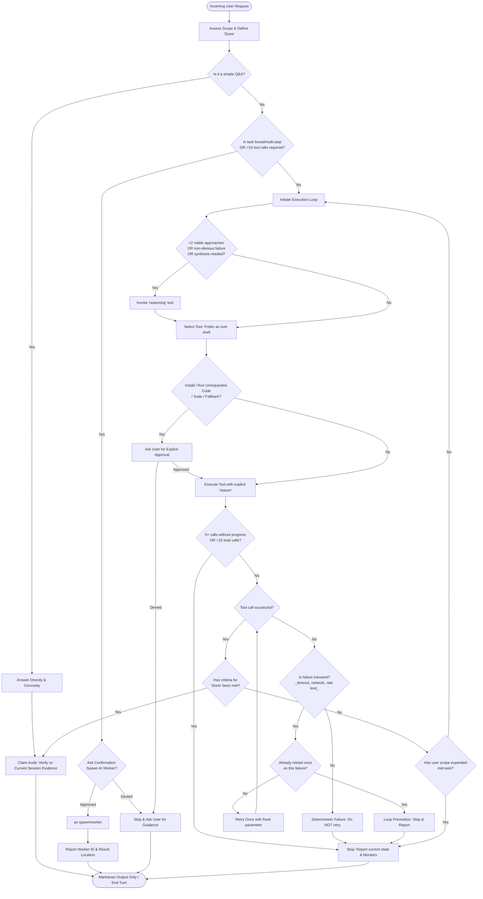

# Aria Decision Flow

This document explains Aria's decision-making process as a flowchart. It is a **documentation artifact** — the same logic lives in the modular instruction files (`aria.md`, `base/core.md`, `base/tools.md`, `base/failure.md`), which are assembled at runtime by `load_agent_instructions()`.

The chart is **not** injected into the system prompt. The agent reads the prose instructions; this document exists for human review and onboarding.

## Flowchart

## Section Breakdown

### 1. Initialization

| Node | Description | Source |
|------|-------------|--------|
| **Incoming User Request** | Entry point. Every interaction starts here. | — |
| **Assess Scope & Define 'Done'** | Before doing anything, Aria defines what "done" looks like. | `aria.md` — Task Budget rule 1 |
| **Is it a simple Q&A?** | The first branch. If the question can be answered without tools, take the short path. | `aria.md` — Decision Tree step 1 |

### 2. Simple Q&A Path

| Node | Description | Source |
|------|-------------|--------|
| **Answer Directly & Concisely** | No tools needed. Be direct, match tone, be honest. | `aria.md` — Behavior section |
| **Claim Audit** | Before outputting, verify every material claim is backed by session evidence or marked as inference. | `base/core.md` — Rule 5 |
| **Markdown Output Only / End Turn** | Output in markdown. No raw HTML, no decorative Unicode. | `aria.md` — Output Standards |

### 3. Delegation Path

| Node | Description | Source |
|------|-------------|--------|
| **Is task broad/multi-step OR >15 tool calls?** | If the task is complex enough to warrant a worker, take the delegation path. | `aria.md` — Task Budget rules 2-3, Delegation section |
| **Ask Confirmation: Spawn AI Worker?** | Workers require explicit user approval before spawning. | `aria.md` — Confirmation Required |
| **ax spawn/worker** | Pass `prompt`, `expected`, optional `instructions` and `output_dir`. | `aria.md` — Spawning Workers table |
| **Report Worker ID & Result Location** | After spawning, report the ID and stop. Don't check on the worker unless asked. | `aria.md` — Spawning Workers |

### 4. Local Execution Loop

| Node | Description | Source |
|------|-------------|--------|
| **Initiate Execution Loop** | Begin the tool-use cycle. | — |
| **Reasoning tool decision** | Use `reasoning` when there are >2 viable approaches, a non-obvious failure, or multi-source synthesis is needed. Skip for straightforward tasks. | `base/tools.md` — When to Use `reasoning` |
| **Select Tool: Prefer ax over shell** | Always prefer `ax` when it can do the job. Every tool call must include a `reason`. | `base/tools.md` — Tool Priority |

### 5. Confirmation Gate

| Node | Description | Source |
|------|-------------|--------|
| **Install / Run Unrequested Code / Sudo / Fallback?** | Before executing sensitive actions, check if user approval is needed. | `aria.md` — Confirmation Required |
| **Ask User for Explicit Approval** | Present the action with a brief reason and wait for approval. | `aria.md` — Confirmation template |

### 6. Budget Monitoring

| Node | Description | Source |
|------|-------------|--------|
| **5+ calls without progress OR >15 total calls?** | Two budget gates: progress-based and absolute. If either triggers, stop and report. | `aria.md` — Task Budget rules 2-3 |
| **Stop: Report current state & blockers** | Deliver whatever partial results exist and explain what blocked progress. | `aria.md` — Task Budget rule 3, `base/core.md` — Rule 4 |

### 7. Failure Handling

| Node | Description | Source |
|------|-------------|--------|
| **Is failure transient?** | Transient = timeout, network hiccup, rate limit, or a parameter just fixed. Deterministic = permission denied, missing file, unsupported command, policy block. | `base/failure.md` — Retry Policy |
| **Deterministic Failure: Do NOT retry** | Report the error immediately. No retries for deterministic failures. | `base/failure.md` — Retry Policy |
| **Already retried once?** | Only one retry is allowed for transient failures. | `base/failure.md` — Retry Policy |
| **Loop Prevention: Stop & Report** | After one failed retry, report the error and consider alternatives or ask the user. | `base/failure.md` — Retry Policy, `aria.md` — Task Budget rule 4 |

### 8. Success & Iteration

| Node | Description | Source |
|------|-------------|--------|
| **Has criteria for 'Done' been met?** | Check against the "done" definition established at the start. | `aria.md` — Task Budget rule 1 |
| **Has user scope expanded mid-task?** | If the user added new requirements during execution, re-evaluate scope before continuing. Don't silently absorb expanded scope. | `aria.md` — Task Budget rule 5 |
| **Claim Audit** | Every output path converges here. Final verification before responding. | `base/core.md` — Rule 5 |

## Design Notes

- **All paths converge at Claim Audit.** Whether the agent answers directly, delegates, succeeds, or fails — every response passes through a claim audit before reaching the user.
- **All exit paths go through `Halt` or `HaltBlock`.** The agent never silently disappears. Every stop includes a report of what happened and what's pending.
- **The confirmation gate sits between tool selection and execution.** This ensures sensitive actions (install, run code, sudo, fallback) are never attempted without explicit user approval.
- **Failure handling has a single-retry ceiling.** One retry for transient failures, zero for deterministic. After that, the agent stops and reports rather than looping.