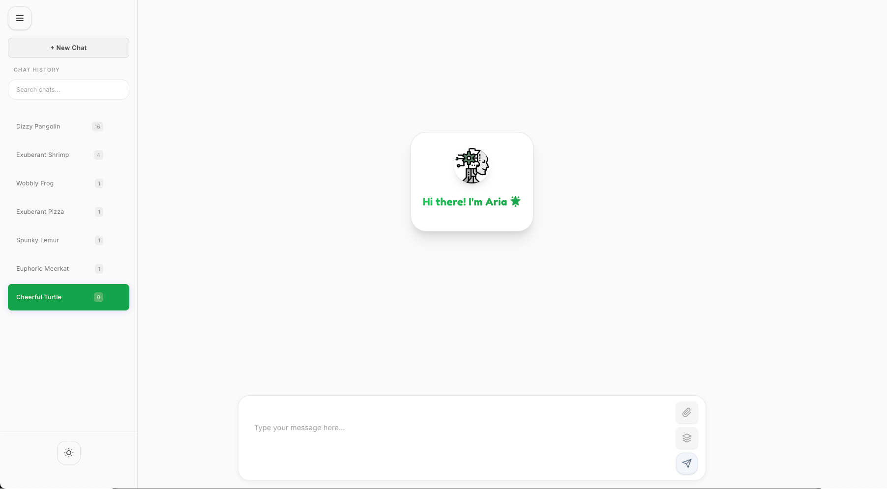

# Aria: Your Personal AI Assistant

Aria is a powerful, self-hosted AI assistant designed for reasoning, task completion, and seamless interaction. It provides a feature-rich chat interface with multi-session support, real-time streaming responses, and advanced AI capabilities.

## ✨ Features

- **Multi-Session Chat**: Manage multiple conversations with persistent history.
- **Real-Time Streaming**: Get instant responses from the AI as they are generated.
- **Markdown & Mermaid Support**: Render rich text and diagrams directly in the chat.
- **AI-Powered Tools**:
  - **Web Search**: Access real-time information from the web.
  - **Reasoning Engine**: Perform complex reasoning and analysis.
  - **YouTube Analysis**: Extract insights from YouTube videos.
  - **Weather & Finance Data**: Get up-to-date information on weather and financial markets.
- **Prompt Improvement**: Automatically enhance your prompts for better AI responses.
- **Dockerized Deployment**: Easy to set up and run with Docker.

## 🏗️ Architecture

Aria is built with a modern, modular architecture:

- **Backend**: A robust FastAPI server that handles all business logic, including:
  - Session and message management
  - Integration with Ollama for AI model access
  - A suite of AI tools for enhanced capabilities
- **Frontend**: A responsive web UI built with HTML, CSS, and JavaScript, providing a seamless user experience.
- **AI Core**: Powered by Ollama, allowing you to use a variety of open-source language models.
- **Services**:
  - **Redis**: For caching and session management.
  - **SearXNG**: For private and secure web search.
  - **Byparr**: For additional backend functionality.

## Quick Links

- [Installation Guide](installation.html)
- [Configuration Options](configuration.html)
- [Usage Documentation](usage.html)
- [License Information](license.html)
- [GitHub Repository](https://github.com/malvavisc0/aria)
