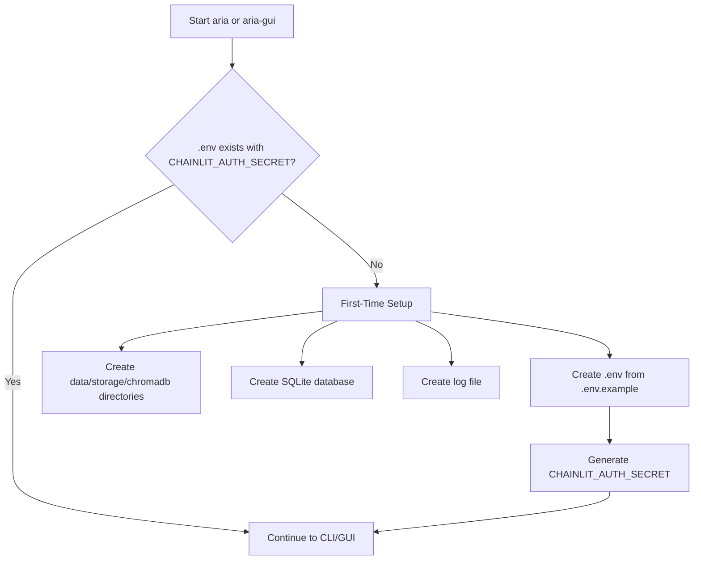
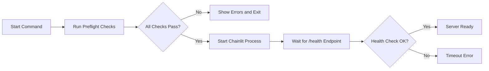
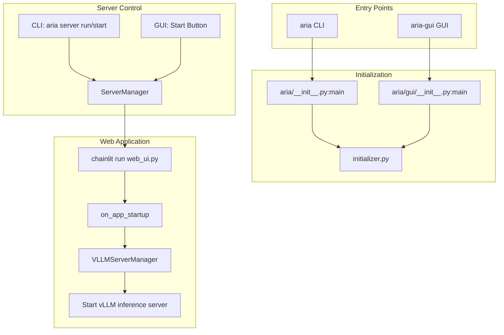

# Aria Project Startup Guide

This document describes how to start the Aria project via CLI and GUI, including the initialization flow and server management.

## Table of Contents

- [Prerequisites](#prerequisites)
- [Installation](#installation)
- [Starting the Project](#starting-the-project)
  - [CLI Method](#cli-method)
  - [GUI Method](#gui-method)
- [First-Time Initialization](#first-time-initialization)
- [Server Management](#server-management)
- [Preflight Checks](#preflight-checks)
- [Architecture Overview](#architecture-overview)

## Prerequisites

- Python 3.12 or higher
- `uv` package manager (recommended) or pip
- Git (for cloning the repository)

### Optional Hardware

Aria supports multiple compute platforms:

| Platform | Description |
|----------|-------------|
| NVIDIA GPU | CUDA acceleration with VRAM for model inference (via vLLM) |
| CPU-only | Fallback mode without GPU acceleration (slower) |

The preflight checks automatically detect your platform and adjust memory requirements accordingly.

## Installation

```bash
# Clone the repository
git clone <repository-url>
cd aria

# Install dependencies with uv
uv sync

# Or install with GUI support
uv sync --extra gui
```

## Starting the Project

### CLI Method

The CLI provides full control over the Aria system, including server management, user administration, and model downloads.

#### Start the Web Server

```bash
# Run in foreground (blocking, Ctrl+C to stop)
aria server run

# Start in background
aria server start

# Check server status
aria server status

# Stop the server
aria server stop
```

#### Other CLI Commands

```bash
# Check system readiness
aria check

# User management
aria users list
aria users add

# Model management
aria models list
aria models download

# System information
aria system info
aria system gpu

# Configuration
aria config show

# Agent tool commands
aria search web "query"         # Web search
aria knowledge store "key" "v"  # Store a fact
aria finance stock TICKER       # Stock price
aria imdb search "title"        # Search movies/TV
aria dev run "code"             # Execute Python
aria vllm install               # Install vLLM
aria vllm status                # Check vLLM status
aria worker spawn --prompt "..." # Background worker
aria self test-tools            # Verify tools
```

### GUI Method

The GUI provides a graphical interface for server management and monitoring.

```bash
# Launch the GUI application
aria-gui
```

The GUI window provides:
- **Overview tab**: Server status, PID, URL, uptime
- **Setup tab**: Download binaries and models
- **Users tab**: Manage user accounts
- **Logs tab**: View application logs

Use the Start/Stop/Open buttons to control the web server.

## First-Time Initialization

On first launch (both CLI and GUI), Aria automatically performs initialization:



### What Gets Created

| Item | Location | Description |
|------|----------|-------------|
| `.env` | Project root | Configuration with generated auth secret |
| `data/` | Project root | Database and binaries |
| `storage/` | Project root | Uploaded files |
| `chromadb/` | Project root | Vector database |
| `aria.db` | `data/` | SQLite database |
| `logs/aria.log` | `data/` | Application logs |

## Server Management

### Server Lifecycle



### ServerManager

Both CLI and GUI use the [`ServerManager`](../src/aria/server/manager.py) class to control the Chainlit webserver:

| Method | Description |
|--------|-------------|
| `start()` | Start server in background |
| `run()` | Run server in foreground (blocking) |
| `stop()` | Stop the server |
| `is_running()` | Check if process is alive |
| `is_healthy()` | Check if `/health` returns 200 |
| `get_status()` | Get detailed status info |

### Process State

Server state is persisted to `data/server.json`:

```json
{
  "pid": 12345,
  "host": "localhost",
  "port": 9876,
  "started_at": "2026-02-26T10:00:00"
}
```

This allows the GUI to track servers started by the CLI and vice versa.

## Preflight Checks

Before starting the server, Aria validates the environment:

| Category | Checks |
|----------|--------|
| Environment | Required env vars (DATA_FOLDER, CHAINLIT_AUTH_SECRET, etc.) |
| Storage | Data folder exists, knowledge DB accessible |
| Binaries | vLLM installed, Lightpanda (optional) |
| Models | Chat model downloaded, embeddings model available |
| Hardware | GPU available, sufficient VRAM, memory requirements |
| Connectivity | vLLM server reachable |
| Tools | Core + file tools load correctly |

### Running Preflight Manually

```bash
# CLI
aria check

# The server commands also run preflight automatically
aria server run
```

### Preflight Failures

If preflight fails, the server will not start. Common fixes:

```bash
# Install vLLM
aria vllm install

# Download missing models
aria models download

# Check environment
aria config show
```

## Architecture Overview

### Entry Points

Defined in [`pyproject.toml`](../pyproject.toml):

```toml
[project.scripts]
aria = "aria:main"           # CLI entry point
aria-gui = "aria.gui:main"   # GUI entry point
```

### Component Flow



### Key Files

| File | Purpose |
|------|---------|
| [`src/aria/__init__.py`](../src/aria/__init__.py) | CLI entry point |
| [`src/aria/gui/__init__.py`](../src/aria/gui/__init__.py) | GUI entry point |
| [`src/aria/initializer.py`](../src/aria/initializer.py) | First-run setup |
| [`src/aria/preflight.py`](../src/aria/preflight.py) | Environment validation |
| [`src/aria/cli/main.py`](../src/aria/cli/main.py) | CLI commands |
| [`src/aria/cli/server.py`](../src/aria/cli/server.py) | Server CLI commands |
| [`src/aria/server/manager.py`](../src/aria/server/manager.py) | Server lifecycle |
| [`src/aria/web_ui.py`](../src/aria/web_ui.py) | Chainlit application |
| [`src/aria/gui/windows/main_window.py`](../src/aria/gui/windows/main_window.py) | GUI main window |
| [`src/aria/cli/self_cmd.py`](../src/aria/cli/self_cmd.py) | Self-awareness CLI (test-tools) |
| [`src/aria/agents/worker.py`](../src/aria/agents/worker.py) | Worker agent factory |
| [`src/aria/gui/windows/server_handlers.py`](../src/aria/gui/windows/server_handlers.py) | GUI server controls |

## Troubleshooting

### Server Won't Start

1. Run `aria check` to identify issues
2. Check logs in `data/logs/aria.log`
3. Verify all models are downloaded: `aria models list`
4. Verify vLLM is installed: `aria vllm status`

### Port Already in Use

```bash
# Check what's using the port
lsof -i :9876

# Or change the port in .env
SERVER_PORT = 9877
```

### GUI Not Available

The GUI requires the `gui` extra:

```bash
uv sync --extra gui
```

### Database Issues

```bash
# Check database connectivity
aria check

# The database file is located at
data/aria.db