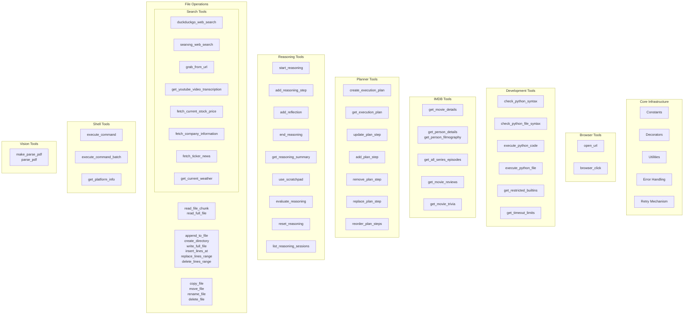

# Aria Tools Inventory

A comprehensive guide to all tools available in the `src/aria/tools` package. Each tool is designed for specific use cases and returns JSON-formatted responses.

---

## Table of Contents

1. [Core Infrastructure](#1-core-infrastructure)
2. [Browser Tools](#2-browser-tools)
3. [Development Tools](#3-development-tools)
4. [File Operations](#4-file-operations)
5. [IMDB Tools](#5-imdb-tools)
6. [Planner Tools](#6-planner-tools)
7. [Reasoning Tools](#7-reasoning-tools)
8. [Search Tools](#8-search-tools)
9. [Shell Tools](#9-shell-tools)
10. [Vision Tools](#10-vision-tools)

---

## 1. Core Infrastructure

**Package:** [`aria.tools`](src/aria/tools/)

### Overview

The core infrastructure provides shared utilities, decorators, constants, error handling, and retry mechanisms used across all tool modules.

### Constants ([`aria.tools.constants`](src/aria/tools/constants.py))

| Constant | Value | Description |
|----------|-------|-------------|
| `BASE_DIR` | `Path` | Base directory for all file operations (defaults to `Data.path`) |
| `CODE_DIR` | `BASE_DIR / "code"` | Directory for code files |
| `DOWNLOADS_DIR` | `BASE_DIR / "downloads"` | Directory for downloads |
| `REPORTS_DIR` | `BASE_DIR / "reports"` | Directory for reports |
| `MAX_FILE_SIZE` | `5 * 1024 * 1024` | Maximum file size for processing (5MB) |
| `DEFAULT_TIMEOUT` | `30` | Default timeout for operations (seconds) |
| `MAX_TIMEOUT` | `300` | Maximum timeout limit (seconds) |
| `NETWORK_TIMEOUT` | `10` | Network request timeout (seconds) |

### Decorators ([`aria.tools.decorators`](src/aria/tools/decorators.py))

#### `log_tool_call(func)`

Logs tool calls with intent parameter. Extracts intent from the first argument and logs the function call.

```python
@log_tool_call
def my_tool(intent: str, ...) -> str:
    """Tool that logs its intent."""
    ...
```

#### `tool_function(operation_name, *, validate, error_handler, validation_decorator)`

Composes logging, validation, and error handling for tool functions.

**Wrapper order (outermost → innermost):**
1. `log_tool_call`
2. Validation decorator (optional)
3. Error handler decorator (optional)

```python
@tool_function(
    "my_operation",
    validate={"code": True},
    error_handler=with_runner_error_handling,
    validation_decorator=with_input_validation,
)
def my_tool(intent: str, code: str) -> str:
    ...
```

### Utilities ([`aria.tools.utils`](src/aria/tools/utils.py))

#### `utc_timestamp() -> str`

Generate a UTC ISO timestamp string.

#### `safe_json(data, *, default, indent, ensure_ascii) -> str`

Safe JSON serialization with error handling. Falls back to `str()` for non-serializable objects.

#### `tool_success_response(tool, intent, data, **context) -> str`

Generate a standardized JSON success response.

**Response structure:**
```json
{
  "status": "success",
  "tool": "tool_name",
  "intent": "why this was called",
  "timestamp": "2024-01-01T12:00:00Z",
  "data": {...}
}
```

#### `tool_error_response(tool, intent, exc, **context) -> str`

Generate a standardized JSON error response from an exception.

**Response structure:**
```json
{
  "status": "error",
  "tool": "tool_name",
  "intent": "why this was called",
  "timestamp": "2024-01-01T12:00:00Z",
  "error": {
    "code": "ERROR_CODE",
    "message": "human readable message",
    "type": "ExceptionType",
    "recoverable": true,
    "how_to_fix": "guidance for recovery"
  }
}
```

### Error Handling ([`aria.tools.errors`](src/aria/tools/errors.py))

Base exception class for all tool operations.

```python
class ToolError(Exception):
    code: str = "INTERNAL_ERROR"
    recoverable: bool = False
    how_to_fix: str = "An unexpected error occurred."
```

### Retry Mechanism ([`aria.tools.retry`](src/aria/tools/retry.py))

#### `with_retry(max_retries=3, backoff_factor=1.5, retryable_exceptions=(Exception,))`

Decorator for retrying operations on transient failures with exponential backoff.

```python
@with_retry(max_retries=3, backoff_factor=2.0)
async def unreliable_network_call():
    ...
```

---

## 2. Browser Tools

**Package:** [`aria.tools.browser`](src/aria/tools/browser/)

### Requirements

Requires Lightpanda browser (`aria lightpanda download`). The browser is started automatically when the Aria server starts.

### Overview

Browser automation tools using Lightpanda with Playwright CDP. Use for browsing dynamic web content that requires JavaScript rendering or bypasses anti-bot protection.

### Functions

#### `open_url(intent: str, url: str) -> str`

Opens a URL in the headless browser and gets page content.

| Parameter | Type | Description |
|-----------|------|-------------|
| `intent` | `str` | Why you are opening this URL (e.g., "Reading documentation") |
| `url` | `str` | The URL to navigate to |

**When to use:**
- Browsing websites that require JavaScript rendering
- Accessing content behind anti-bot protection
- Scraping dynamic web content
- NOT for downloading files (use `grab_from_url` instead)

**Example:**
```python
result = await open_url("Reading documentation", "https://docs.python.org/3/")
```

#### `browser_click(intent: str, selector: str) -> str`

Clicks an element by CSS selector.

| Parameter | Type | Description |
|-----------|------|-------------|
| `intent` | `str` | Why you are clicking (e.g., "Accepting cookies") |
| `selector` | `str` | CSS selector (e.g., `'button.accept'`, `'a.next'`) |

**When to use:**
- Accepting cookie consent banners
- Clicking 'Load more' buttons
- Navigating pagination
- Following links

**Example:**
```python
# Click a button with class "accept"
result = await browser_click("Accepting cookies", "button.accept")

# Click a link by href
result = await browser_click("Going to next page", "a.next-page")
```

---

## 3. Development Tools

**Package:** [`aria.tools.development`](src/aria/tools/development/)

### Overview

Python execution and syntax-check tools with sandboxed execution environments. Restricted builtins are blocked for safety.

### Functions

#### `check_python_syntax(intent: str, code: str) -> str`

Check Python syntax of a code string without executing it.

| Parameter | Type | Description |
|-----------|------|-------------|
| `intent` | `str` | Why you're checking (e.g., "Validating before execution") |
| `code` | `str` | Python code string to validate |

**Returns:** JSON with `valid`, `error_type`, `message`, `line_number`, `column`.

**When to use:**
- Validating code before execution
- Catching syntax errors early
- Checking code from external sources

#### `check_python_file_syntax(intent: str, file_path: str) -> str`

Check Python syntax of a file.

| Parameter | Type | Description |
|-----------|------|-------------|
| `intent` | `str` | Why you're checking (e.g., "Validating saved file") |
| `file_path` | `str` | Path to Python file relative to BASE_DIR |

#### `execute_python_code(intent: str, code: str, timeout=30, capture_output=True, argv=None) -> str`

Execute Python code string with optional timeout/output capture.

| Parameter | Type | Default | Description |
|-----------|------|---------|-------------|
| `intent` | `str` | - | Why you're executing (e.g., "Testing algorithm") |
| `code` | `str` | - | Python code to execute |
| `timeout` | `int` | `30` | Max seconds (1-300) |
| `capture_output` | `bool` | `True` | Capture stdout/stderr |
| `argv` | `list[str]` | `None` | CLI arguments for `sys.argv` |

**Returns:** JSON with `success`, `stdout`, `stderr`, `error_type`, `traceback`.

#### `execute_python_file(intent: str, file_path: str, timeout=30, capture_output=True, argv=None) -> str`

Execute a Python file.

| Parameter | Type | Default | Description |
|-----------|------|---------|-------------|
| `intent` | `str` | - | Why you're executing |
| `file_path` | `str` | - | Path to Python file |
| `timeout` | `int` | `30` | Max seconds (1-300) |
| `capture_output` | `bool` | `True` | Capture stdout/stderr |
| `argv` | `list[str]` | `None` | CLI arguments for `sys.argv` |

#### `get_restricted_builtins(intent: str) -> str`

Get list of builtins blocked for security.

```python
result = get_restricted_builtins("Checking security restrictions")
```

#### `get_timeout_limits(intent: str) -> str`

Get the default and maximum timeout limits.

```python
result = get_timeout_limits("Checking timeout configuration")
```

---

## 4. File Operations

**Package:** [`aria.tools.files`](src/aria/tools/files/)

### Overview

Comprehensive file operations including reading, writing, and management. Public file and directory paths are absolute and constrained to [`BASE_DIR`](src/aria/tools/constants.py:34) for security.

### Read Operations ([`aria.tools.files.read_operations`](src/aria/tools/files/read_operations.py))

#### `file_exists(intent: str, file_name: str) -> str`

Check whether a file/directory exists.

```python
result = file_exists("Verifying config exists", "config.json")
# Returns: {"exists": true, "is_file": true, "is_directory": false}
```

#### `get_directory_tree(intent: str, path: str, max_depth=3) -> str`

Return a directory tree summary.

| Parameter | Type | Default | Description |
|-----------|------|---------|-------------|
| `intent` | `str` | - | Why you're getting tree |
| `path` | `str` | - | Directory path relative to BASE_DIR |
| `max_depth` | `int` | `3` | Maximum depth to traverse |

#### `search_in_files(intent: str, regex_pattern: str, file_pattern="**/*", recursive=False, max_files=100, max_matches=500, context_lines=2) -> str`

Search for text/regex pattern inside files matched from [`BASE_DIR`](src/aria/tools/constants.py:34).

| Parameter | Type | Default | Description |
|-----------|------|---------|-------------|
| `intent` | `str` | - | Why you're searching |
| `regex_pattern` | `str` | - | Regex pattern to match |
| `file_pattern` | `str` | `"**/*"` | Glob pattern to select candidate files |
| `recursive` | `bool` | `False` | Whether to recurse from [`BASE_DIR`](src/aria/tools/constants.py:34) |
| `max_files` | `int` | `100` | Maximum files to inspect |
| `max_matches` | `int` | `500` | Maximum matches to return |
| `context_lines` | `int` | `2` | Number of context lines around each match |

#### `search_files_by_name(intent: str, regex_pattern: str, recursive=True, max_results=500) -> str`

Search for files by name using a regex against filenames under [`BASE_DIR`](src/aria/tools/constants.py:34).

| Parameter | Type | Default | Description |
|-----------|------|---------|-------------|
| `intent` | `str` | - | Why you're searching |
| `regex_pattern` | `str` | - | Regular expression matched against file names |
| `recursive` | `bool` | `True` | Whether to recurse from [`BASE_DIR`](src/aria/tools/constants.py:34) |
| `max_results` | `int` | `500` | Maximum matches to return |

#### `read_file_chunk(intent: str, file_name: str, chunk_size=100, offset=0) -> str`

Read a chunk of file contents with optional line range.

| Parameter | Type | Default | Description |
|-----------|------|---------|-------------|
| `intent` | `str` | - | Why you're reading |
| `file_name` | `str` | - | Absolute path within [`BASE_DIR`](src/aria/tools/constants.py:34) |
| `chunk_size` | `int` | `100` | Number of lines to read |
| `offset` | `int` | `0` | Starting line number (0-indexed) |

#### `read_full_file(intent: str, file_name: str, max_lines=500) -> str`

Read entire file contents.

| Parameter | Type | Default | Description |
|-----------|------|---------|-------------|
| `intent` | `str` | - | Why you are reading |
| `file_name` | `str` | - | Absolute path within [`BASE_DIR`](src/aria/tools/constants.py:34) |
| `max_lines` | `int` | `500` | Maximum lines allowed before requiring chunked reads |

```python
result = read_full_file("Reading configuration", "/absolute/path/config.json")
```

#### `get_file_info(intent: str, file_name: str) -> str`

Get file metadata (size, permissions, timestamps).

```python
result = get_file_info("Checking file details", "document.pdf")
```

#### `get_file_permissions(intent: str, file_name: str) -> str`

Get file permissions in symbolic format (e.g., `rw-r--r--`).

```python
result = get_file_permissions("Checking permissions", "script.sh")
```

#### `list_files(intent: str, pattern="*", recursive=False, max_results=100) -> str`

List files matching a glob pattern under [`BASE_DIR`](src/aria/tools/constants.py:34).

```python
result = list_files("Listing Python files", "*.py", recursive=True)
```

### Write Operations ([`aria.tools.files.write_operations`](src/aria/tools/files/write_operations.py))

#### `append_to_file(intent: str, file_name: str, contents: str) -> str`

Append text to an existing file.

```python
result = append_to_file("Adding log entry", "app.log", "New log entry\n")
```

#### `create_directory(intent: str, dir_name: str) -> str`

Create a directory including parent directories.

```python
result = create_directory("Setting up project structure", "/absolute/path/inside/base/new_project/src")
```

#### `write_full_file(intent: str, file_name: str, contents: str) -> str`

Write content to a file (creates backup by default).

```python
result = write_full_file("Saving configuration", "/absolute/path/inside/base/config.json", '{"key": "value"}')
```

#### `insert_lines_at(intent: str, file_name: str, new_lines: list[str], offset: int) -> str`

Insert lines at a specific position.

| Parameter | Type | Description |
|-----------|------|-------------|
| `intent` | `str` | Why you're inserting |
| `file_name` | `str` | Absolute path within [`BASE_DIR`](src/aria/tools/constants.py:34) |
| `new_lines` | `list[str]` | Lines to insert |
| `offset` | `int` | Line number to insert at |

```python
result = insert_lines_at(
    intent="Adding function",
    file_name="/absolute/path/inside/base/utils.py",
    new_lines=["def new_func():", "    pass"],
    offset=10,
)
```

#### `replace_lines_range(intent: str, file_name: str, offset: int, length: int, new_lines=None) -> str`

Replace or delete a range of lines.

| Parameter | Type | Description |
|-----------|------|-------------|
| `intent` | `str` | Why you're replacing |
| `file_name` | `str` | Absolute path within [`BASE_DIR`](src/aria/tools/constants.py:34) |
| `offset` | `int` | Starting line (0-indexed) |
| `length` | `int` | Number of lines to replace |
| `new_lines` | `list[str]` | Replacement lines (None = delete) |

#### `delete_lines_range(intent: str, file_name: str, offset: int, length: int) -> str`

Delete a contiguous range of lines.

```python
result = delete_lines_range("Removing obsolete code", "/absolute/path/inside/base/old.py", 5, 10)
```

### File Management ([`aria.tools.files.file_management`](src/aria/tools/files/file_management.py))

#### `copy_file(intent: str, source: str, destination: str, overwrite=False) -> str`

Copy a file.

```python
result = copy_file("Creating backup", "original.txt", "backup.txt", overwrite=True)
```

#### `move_file(intent: str, source: str, destination: str) -> str`

Move a file.

```python
result = move_file("Reorganizing project", "old/name.txt", "new/name.txt")
```

#### `rename_file(intent: str, old_name: str, new_name: str) -> str`

Rename/move a file.

```python
result = rename_file("Fixing filename typo", "old_name.txt", "new_name.txt")
```

#### `delete_file(intent: str, file_name: str) -> str`

Delete a file (creates backup first).

```python
result = delete_file("Removing obsolete file", "old_file.txt")
```

---

## 5. IMDB Tools

**Package:** [`aria.tools.imdb`](src/aria/tools/imdb/)

### Overview

Movie and TV series information retrieval using the `imdbinfo` package. Designed for the IMDB Expert agent.

### Functions

#### `search_imdb_titles(intent: str, query: str, title_type=None) -> str`

Search for movies, TV series, and other titles on IMDb.

| Parameter | Type | Description |
|-----------|------|-------------|
| `intent` | `str` | Why you're searching (e.g., "Finding Matrix movie") |
| `query` | `str` | The title to search for |
| `title_type` | `str` | Optional filter: `movie`, `series`, `episode`, `short`, `tv_movie`, `video` |

```python
result = search_imdb_titles("Finding Matrix movie", "Matrix", title_type="movie")
```

#### `get_movie_details(intent: str, imdb_id: str) -> str`

Get detailed information about a movie.

```python
result = get_movie_details("Getting movie details", "tt0133093")  # The Matrix
```

#### `get_person_details(intent: str, person_id: str) -> str`

Get detailed information about a person (actor, director, etc.).

```python
result = get_person_details("Getting actor info", "tt0000206")  # Keanu Reeves
```

#### `get_person_filmography(intent: str, person_id: str) -> str`

Get filmography for an actor/director.

```python
result = get_person_filmography("Finding Keanu Reeves movies", "nm0000206")
```

#### `get_all_series_episodes(intent: str, imdb_id: str) -> str`

Get all episodes for a TV series.

```python
result = get_all_series_episodes("Getting Breaking Bad episodes", "tt0903747")
```

#### `get_movie_reviews(intent: str, imdb_id: str) -> str`

Get user reviews for a movie.

```python
result = get_movie_reviews("Reading reviews", "tt0133093")
```

#### `get_movie_trivia(intent: str, imdb_id: str) -> str`

Get trivia/fun facts for a movie.

```python
result = get_movie_trivia("Getting trivia", "tt0133093")
```

---

## 6. Planner Tools

**Package:** [`aria.tools.planner`](src/aria/tools/planner/)

### Overview

Structured execution plans with step management. Each plan is isolated by `execution_id`, allowing multiple concurrent plan executions. All plans are persisted to the database.

### Functions

#### `create_execution_plan(reason: str, task: str, steps: list[str], agent_id="default") -> str`

Create a new execution plan.

| Parameter | Type | Description |
|-----------|------|-------------|
| `reason` | `str` | Why you need planning |
| `task` | `str` | Overall task description |
| `steps` | `list[str]` | List of step descriptions |
| `agent_id` | `str` | Agent identifier (for multi-agent) |

**When to use:**
- Complex tasks with multiple steps
- When you need to track progress
- Coordinating multi-step workflows

```python
result = create_execution_plan(
    reason="Building a web scraper",
    task="Create a web scraper for news articles",
    steps=[
        "Setup project structure",
        "Implement HTTP client",
        "Parse HTML content",
        "Save to database"
    ]
)
```

#### `get_execution_plan(reason: str, execution_id: str) -> str`

Get the current state of an execution plan.

```python
result = get_execution_plan("Checking progress", execution_id)
```

#### `update_plan_step(reason: str, execution_id: str, step_id: str, status: str, step_result=None) -> str`

Update the status of a specific step.

| Parameter | Type | Description |
|-----------|------|-------------|
| `reason` | `str` | Why you're updating |
| `execution_id` | `str` | Plan identifier |
| `step_id` | `str` | Step identifier |
| `status` | `str` | `pending`, `in_progress`, `completed`, `failed` |
| `step_result` | `str` | Optional result data |

```python
result = update_plan_step(
    "Completed setup", execution_id, "step-1", "completed", "Project created"
)
```

#### `add_plan_step(reason: str, execution_id: str, after_step_id: str | None, new_step: str) -> str`

Add a new step to an existing plan.

```python
result = add_plan_step(
    "Adding new step",
    execution_id,
    after_step_id="step-4",
    new_step="Deploy application"
)
```

#### `remove_plan_step(reason: str, execution_id: str, step_id: str) -> str`

Remove a step from a plan.

```python
result = remove_plan_step("Removing unnecessary step", execution_id, "step-3")
```

#### `replace_plan_step(reason: str, execution_id: str, step_id: str, new_step: str) -> str`

Replace a step's description.

```python
result = replace_plan_step("Updating step", execution_id, "step-2", "New description")
```

#### `reorder_plan_steps(reason: str, execution_id: str, step_ids: list[str]) -> str`

Reorder steps by providing a new list of step IDs in order.

```python
result = reorder_plan_steps("Reordering", execution_id, ["step-1", "step-3", "step-2"])
```

---

## 7. Reasoning Tools

**Package:** [`aria.tools.reasoning`](src/aria/tools/reasoning/)

### Overview

Structured reasoning for complex tasks with session-based tracking. Each agent has ONE active reasoning session automatically managed. Sessions are persisted to database.

### Concepts

- **Session**: Container for reasoning steps
- **Cognitive Modes**: `planning`, `analysis`, `evaluation`, `synthesis`, `creative`, `reflection`
- **Reasoning Types**: `deductive`, `inductive`, `abductive`, `causal`, `probabilistic`, `analogical`

### Functions

#### `start_reasoning(intent: str, agent_id="aria") -> dict`

Begin structured reasoning for a complex task.

```python
result = start_reasoning("Analyzing deployment options")
```

**When to use:**
- Complex tasks with multiple steps
- Tasks with tradeoffs
- Tasks requiring tracking partial findings

#### `add_reasoning_step(intent: str, content: str, agent_id="aria", cognitive_mode="analysis", reasoning_type="deductive", evidence=None, confidence=0.65) -> dict`

Record one reasoning step in the active session.

| Parameter | Type | Default | Description |
|-----------|------|---------|-------------|
| `intent` | `str` | - | Why you're adding this step |
| `content` | `str` | - | The reasoning content |
| `agent_id` | `str` | `"aria"` | Agent identifier |
| `cognitive_mode` | `str` | `"analysis"` | Type of thinking |
| `reasoning_type` | `str` | `"deductive"` | Logical approach |
| `evidence` | `list[str]` | `None` | Evidence supporting this step |
| `confidence` | `float` | `0.65` | Confidence level (0.0-1.0) |

**Cognitive modes explained:**
- `"planning"` — outlining steps, constraints, contingencies
- `"analysis"` — examining evidence, data, tool results
- `"evaluation"` — assessing quality, failures, comparing options
- `"synthesis"` — combining findings into a conclusion
- `"creative"` — generating alternatives, reframing problem
- `"reflection"` — checking for bias, gaps, assumptions

```python
result = add_reasoning_step(
    intent="Recording observation",
    content="The file structure suggests a Flask application",
    cognitive_mode="analysis",
    reasoning_type="deductive",
    evidence=["routes.py found", "templates/ directory exists"]
)
```

#### `add_reflection(intent: str, reflection: str, agent_id="aria", on_step=None) -> dict`

Pause and reflect on reasoning process.

```python
result = add_reflection(
    intent="Checking for confirmation bias",
    reflection="Am I only looking for evidence that confirms Flask hypothesis?"
)
```

#### `end_reasoning(intent: str, agent_id="aria") -> dict`

End the reasoning session.

```python
result = end_reasoning(
    intent="Completing analysis"
)
```

#### `get_reasoning_summary(intent: str, agent_id="aria") -> dict`

Get a summary of the current reasoning session.

```python
result = get_reasoning_summary("Getting reasoning overview")
```

#### `use_scratchpad(intent: str, key: str, agent_id="aria", value=None, operation="get") -> dict`

Read/write scratchpad entries for temporary notes.

```python
result = use_scratchpad(
    "Taking notes",
    key="observation-1",
    value="First observation: file structure looks like...",
    operation="set"
)
```

#### `evaluate_reasoning(intent: str, agent_id="aria") -> dict`

Evaluate the quality of the current reasoning session.

```python
result = evaluate_reasoning("Evaluating reasoning quality")
```

#### `reset_reasoning(intent: str, agent_id="aria") -> dict`

Reset/clear the current reasoning session.

```python
result = reset_reasoning("Starting fresh")
```

#### `list_reasoning_sessions(intent: str, agent_id="aria") -> dict`

List all reasoning sessions for the current agent.

```python
result = list_reasoning_sessions("Finding previous sessions")
```

---

## 8. Search Tools

**Package:** [`aria.tools.search`](src/aria/tools/search/)

### Overview

Web search and data retrieval tools using DuckDuckGo, SearXNG, Yahoo Finance, Open-Meteo, and YouTube.

### Web Search

#### `duckduckgo_web_search(intent: str, query: str, max_results=5) -> str`

Search the web using DuckDuckGo and return a small set of `{title, href}` results.

| Parameter | Type | Default | Description |
|-----------|------|---------|-------------|
| `intent` | `str` | - | Why you're searching |
| `query` | `str` | - | Search query string |
| `max_results` | `int` | `5` | Maximum results (1-50) |

**When to use:**
- Quick web searches
- Finding documentation
- General web research

```python
result = duckduckgo_web_search("Finding Python documentation", "Python tutorial", max_results=10)
```

#### `searxng_web_search(intent: str, query: str, category="general", time_range="", max_results=10) -> str`

Search via self-hosted SearXNG instance with more control.

| Parameter | Type | Default | Description |
|-----------|------|---------|-------------|
| `intent` | `str` | - | Why you're searching |
| `query` | `str` | - | Search query |
| `category` | `str` | `"general"` | `general`, `news`, `videos`, `images`, `files` |
| `time_range` | `str` | `""` | Freshness filter: `day`, `week`, `month`, `year` |
| `max_results` | `int` | `10` | Maximum results |

**When to use:**
- Privacy-focused search
- Category-specific searches
- Time-restricted searches

### Download Tools

#### `grab_from_url(intent: str, url: str, output="auto", custom_headers=None, max_size=None, download_path=None, convert_to_markdown=False) -> str`

Download a file from a URL (PDFs, images, archives, HTML, etc.).

| Parameter | Type | Default | Description |
|-----------|------|---------|-------------|
| `intent` | `str` | - | Why you're downloading |
| `url` | `str` | - | Direct URL to the file |
| `output` | `str` | `"auto"` | Format: `auto`, `markdown`, `text`, `binary` |
| `custom_headers` | `dict` | `None` | Optional HTTP headers |
| `max_size` | `int` | `None` | Max bytes (default: 5MB) |
| `download_path` | `str` | `DOWNLOADS_DIR` | Save directory |
| `convert_to_markdown` | `bool` | `False` | Convert HTML to markdown |

**When to use:**
- Downloading PDFs, DOCX, images, videos
- Fetching raw data files (JSON, CSV, XML)
- Converting HTML pages to markdown

#### `get_youtube_video_transcription(intent: str, url: str, download_path=None) -> str`

Get transcription/captions from a YouTube video.

| Parameter | Type | Default | Description |
|-----------|------|---------|-------------|
| `intent` | `str` | - | Why you're transcribing |
| `url` | `str` | - | YouTube video URL |
| `download_path` | `str` | `DOWNLOADS_DIR` | Optional save directory |

### Finance Tools

#### `fetch_current_stock_price(intent: str, ticker: str) -> str`

Fetch current price for a ticker symbol.

| Parameter | Type | Description |
|-----------|------|-------------|
| `intent` | `str` | Why you're fetching |
| `ticker` | `str` | Stock symbol (e.g., `AAPL`, `BTC-USD`) |

```python
result = fetch_current_stock_price("Checking portfolio", "AAPL")
```

**Returns:** `current_price`, `currency`, `market_state`, `day_change`, `day_change_percent`, `previous_close`

#### `fetch_company_information(intent: str, ticker: str) -> str`

Fetch company fundamentals and metadata.

```python
result = fetch_company_information("Researching investment", "GOOGL")
```

**Returns:** `basic_info`, `financial_metrics`, `price_data`, `financial_health`, `analyst_data`

#### `fetch_ticker_news(intent: str, ticker: str, max_articles=10) -> str`

Fetch recent news articles for a ticker.

| Parameter | Type | Default | Description |
|-----------|------|---------|-------------|
| `intent` | `str` | - | Why you're fetching |
| `ticker` | `str` | - | Stock symbol |
| `max_articles` | `int` | `10` | Maximum articles (1-50) |

```python
result = fetch_ticker_news("Getting latest news", "TSLA", max_articles=5)
```

### Weather Tools

#### `get_current_weather(intent: str, location: str) -> str`

Get current weather for a city/location using Open-Meteo (no API key required).

| Parameter | Type | Description |
|-----------|------|-------------|
| `intent` | `str` | Why you're checking |
| `location` | `str` | City name (e.g., "Berlin") |

```python
result = get_current_weather("Planning outdoor activity", "Berlin")
```

**Returns:** `temperature_c`, `wind_speed_kmh`, `weather_code`, `conditions`

---

## 9. Shell Tools

**Package:** [`aria.tools.shell`](src/aria/tools/shell/)

### Overview

Safe shell command execution with timeout handling, output capture, and security constraints. Commands run with `shell=False` for safety. Some commands are blocked for security.

### Functions

#### `execute_command(intent: str, command_name: str, args: list[str], timeout=30, working_dir=None) -> str`

Execute a whitelisted command without shell interpretation.

| Parameter | Type | Default | Description |
|-----------|------|---------|-------------|
| `intent` | `str` | - | Why you're executing |
| `command_name` | `str` | - | Command from safe list (`ls`, `cat`, `git`, `python`, etc.) |
| `args` | `list[str]` | - | Command arguments |
| `timeout` | `int` | `30` | Timeout in seconds (max 300) |
| `working_dir` | `str` | `BASE_DIR` | Working directory |

**Returns:** JSON with `stdout`, `stderr`, `return_code`, `execution_time`.

**When to use:**
- Running CLI tools
- File operations not covered by file tools
- Git operations
- Running scripts

```python
# List directory
result = execute_command("Listing files", "ls", ["-la", "src/"])

# Git status
result = execute_command("Checking git status", "git", ["status"])

# Run Python script
result = execute_command("Running script", "python", ["script.py"], timeout=60)
```

#### `execute_command_batch(intent: str, commands: list[dict], stop_on_error=True) -> str`

Execute multiple commands in sequence.

| Parameter | Type | Default | Description |
|-----------|------|---------|-------------|
| `intent` | `str` | - | Why you're batching |
| `commands` | `list[dict]` | - | List of command specs |
| `stop_on_error` | `bool` | `True` | Stop if command fails |

**Command spec:**
```python
{
    "command_name": "git",
    "args": ["status"],
    "timeout": 30,
    "working_dir": "/path/to/repo",
    "continue_on_error": False
}
```

```python
result = execute_command_batch("Git operations", [
    {"command_name": "git", "args": ["fetch", "origin"]},
    {"command_name": "git", "args": ["status"]},
    {"command_name": "git", "args": ["log", "-3"]}
])
```

#### `get_platform_info(intent: str) -> str`

Get information about the current platform.

```python
result = get_platform_info("Determining shell syntax")
```

**Returns:** `os`, `shell`, `home`, `path_separator`, `temp_dir`, `python_path`

---

## 10. Vision Tools

**Package:** [`aria.tools.vision`](src/aria/tools/vision/)

### Overview

Document analysis tool for vision-language models. Extracts text and tables from PDFs using a VL server.

### Functions

#### `make_parse_pdf(api_base: str, model: str) -> Callable`

Factory that returns a `parse_pdf` async function bound to a VL server.

| Parameter | Type | Description |
|-----------|------|-------------|
| `api_base` | `str` | VL server URL (e.g., `"http://localhost:9091/v1"`) |
| `model` | `str` | Model name (e.g., `"granite-docling-258M-Q8_0.gguf"`) |

**Returns:** An async `parse_pdf(intent: str, file_path: str, prompt="") -> str` function.

#### `parse_pdf(intent: str, file_path: str, prompt="") -> str`

Extract text and tables from a PDF using the vision-language model.

| Parameter | Type | Default | Description |
|-----------|------|---------|-------------|
| `intent` | `str` | - | Why you're extracting |
| `file_path` | `str` | - | Path to PDF file |
| `prompt` | `str` | `""` | Custom extraction instruction |

**Process:**
1. Renders each PDF page to PNG via `pypdfium2` at 150 DPI
2. Base64-encodes PNG bytes
3. Sends to VL server using OpenAI multimodal format
4. Concatenates results into single markdown document
5. Falls back to text extraction if VL fails

**When to use:**
- Extracting content from scanned PDFs
- Converting PDF documents to markdown
- Extracting tables from PDFs
- Processing documents that require visual understanding

```python
# Create the parse_pdf function
parse_pdf = make_parse_pdf("http://localhost:9091/v1", "granite-docling-258M")

# Extract content
result = await parse_pdf(
    "Analyzing document",
    "/path/to/document.pdf",
    "Extract all text and tables"
)
```

**Returns:** JSON with `source_file`, `output_file`, `content_preview`, `total_chars`, `pages_processed`

---

## Summary Diagram



---

## Common Patterns

### Tool Response Format

Tools return JSON strings in two different envelope formats depending on the tool category:

#### Standard Envelope (vision, search, planner, reasoning tools)

**Success:**
```json
{
  "status": "success",
  "tool": "tool_name",
  "intent": "why it was called",
  "timestamp": "2024-01-01T12:00:00Z",
  "data": {...}
}
```

**Error:**
```json
{
  "status": "error",
  "tool": "tool_name",
  "intent": "why it was called",
  "timestamp": "2024-01-01T12:00:00Z",
  "error": {
    "code": "ERROR_CODE",
    "message": "human readable message",
    "type": "ExceptionType",
    "recoverable": false
  }
}
```

#### Operation Envelope (file tools, shell tools)

File tools and shell tools use a different response format via `safe_json()`:

**Success:**
```json
{
  "operation": "operation_name",
  "result": {...},
  "metadata": {
    "timestamp": "2024-01-01T12:00:00Z"
  }
}
```

**Note**: A future task could unify these formats by migrating file/shell tools to the standard envelope.

### Intent Parameter

The `intent` parameter is required in all tools. It should be a clear, human-readable explanation of why the tool is being called. This helps with:
- Debugging
- Audit trails
- Understanding agent behavior

### When to Use Which Tool

| Task | Recommended Tool(s) |
|------|---------------------|
| Browse dynamic web content | `open_url`, `browser_click` |
| Download files (PDFs, images) | `grab_from_url` |
| Validate Python code | `check_python_syntax`, `check_python_file_syntax` |
| Run Python code | `execute_python_code`, `execute_python_file` |
| Read file contents | `read_file_chunk`, `read_full_file` |
| Write/modify files | `append_to_file`, `write_full_file`, `insert_lines_at`, `replace_lines_range`, `delete_lines_range` |
| File management | `copy_file`, `move_file`, `rename_file`, `delete_file` |
| Search movies/TV | `search_imdb_titles` |
| Get movie details | `get_movie_details`, `get_person_filmography` |
| Get TV episodes | `get_all_series_episodes` |
| Multi-step planning | `create_execution_plan`, `update_plan_step` |
| Complex reasoning | `start_reasoning`, `add_reasoning_step`, `add_reflection` |
| Quick web search | `duckduckgo_web_search` |
| Privacy search | `searxng_web_search` |
| Stock data | `fetch_current_stock_price`, `fetch_company_information` |
| Stock news | `fetch_ticker_news` |
| Weather | `get_current_weather` |
| YouTube transcription | `get_youtube_video_transcription` |
| Shell commands | `execute_command`, `execute_command_batch` |
| PDF extraction | `make_parse_pdf`, `parse_pdf` |
