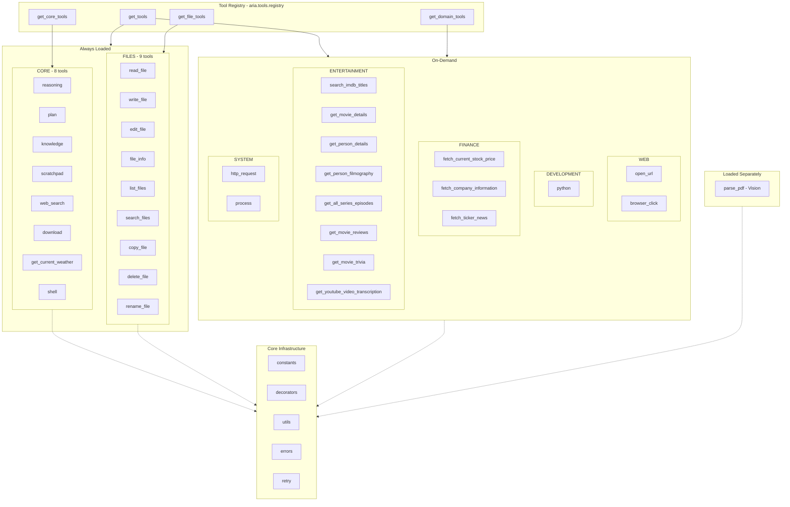

# Aria Tools Inventory

A comprehensive guide to all tools available in the `src/aria/tools` package. Each tool returns JSON-formatted responses. Tools are organized into **7 categories** managed by a centralized registry.

---

## Table of Contents

1. [Core Infrastructure](#1-core-infrastructure)
2. [Tool Registry](#2-tool-registry)
3. [Browser Tools](#3-browser-tools)
4. [Development Tools](#4-development-tools)
5. [File Operations](#5-file-operations)
6. [HTTP Tools](#6-http-tools)
7. [IMDb Tools](#7-imdb-tools)
8. [Knowledge Tools](#8-knowledge-tools)
9. [Planner Tools](#9-planner-tools)
10. [Process Tools](#10-process-tools)
11. [Reasoning Tools](#11-reasoning-tools)
12. [Search Tools](#12-search-tools)
13. [Shell Tools](#13-shell-tools)
14. [Vision Tools](#14-vision-tools)

---

## 1. Core Infrastructure

**Package:** `aria.tools`

### Overview

Shared utilities, decorators, constants, error handling, and retry mechanisms used across all tool modules.

### Constants (`aria.tools.constants`)

| Constant | Value | Description |
|----------|-------|-------------|
| `BASE_DIR` | `Path` | Base directory for file operations (defaults to `Data.path`, overridable via `TOOLS_DATA_FOLDER`) |
| `CODE_DIR` | `BASE_DIR / "code"` | Directory for code files |
| `DOWNLOADS_DIR` | `BASE_DIR / "downloads"` | Directory for downloads |
| `REPORTS_DIR` | `BASE_DIR / "reports"` | Directory for reports |
| `MAX_FILE_SIZE` | `5 * 1024 * 1024` | Maximum file size for processing (5 MB) |
| `DEFAULT_TIMEOUT` | `30` | Default timeout for operations (seconds) |
| `MAX_TIMEOUT` | `300` | Maximum timeout limit (seconds) |
| `NETWORK_TIMEOUT` | `10` | Network request timeout (seconds) |

### Decorators (`aria.tools.decorators`)

#### `log_tool_call(func)`

Logs tool calls with intent parameter. Extracts intent from the first argument. Auto-detects sync/async.

```python
@log_tool_call
def my_tool(intent: str, ...) -> str:
    ...
```

#### `tool_function(operation_name, *, validate, error_handler, validation_decorator)`

Composes logging, validation, and error handling. Wrapper order (outermost to innermost):
1. `log_tool_call`
2. Validation decorator (optional)
3. Error handler decorator (optional)

```python
@tool_function(
    "my_operation",
    validate={"code": True},
    error_handler=with_runner_error_handling,
    validation_decorator=with_input_validation,
)
def my_tool(intent: str, code: str) -> str:
    ...
```

### Utilities (`aria.tools.utils`)

| Function | Description |
|----------|-------------|
| `utc_timestamp() -> str` | Generate UTC ISO 8601 timestamp |
| `safe_json(data, *, default, indent, ensure_ascii) -> str` | Safe JSON serialization with fallback to `str()` |
| `tool_response(tool, intent, data=None, exc=None, **context) -> str` | Auto-selects success/error response |
| `tool_success_response(tool, intent, data, **context) -> str` | Standardized success JSON |
| `tool_error_response(tool, intent, exc, **context) -> str` | Standardized error JSON |
| `get_function_name(depth=1) -> str` | Get calling function name |

**Success response structure:**
```json
{
  "status": "success",
  "tool": "tool_name",
  "intent": "why this was called",
  "timestamp": "2024-01-01T12:00:00Z",
  "data": { }
}
```

**Error response structure:**
```json
{
  "status": "error",
  "tool": "tool_name",
  "intent": "why this was called",
  "timestamp": "2024-01-01T12:00:00Z",
  "error": {
    "code": "ERROR_CODE",
    "message": "Human-readable message",
    "type": "ExceptionClassName",
    "recoverable": false,
    "how_to_fix": "Recovery guidance"
  }
}
```

### Error Handling (`aria.tools.errors`)

`ToolError` -- base exception for all tool operations:

| Attribute | Type | Default | Description |
|-----------|------|---------|-------------|
| `code` | `str` | `"INTERNAL_ERROR"` | Machine-readable error code |
| `recoverable` | `bool` | `False` | Whether the agent can retry |
| `how_to_fix` | `str` | `"An unexpected error occurred."` | Recovery guidance |

### Retry (`aria.tools.retry`)

#### `with_retry(max_retries=3, backoff_factor=1.5, retryable_exceptions=(Exception,))`

Decorator for retrying on transient failures. Supports sync and async. Exponential backoff with jitter.

```python
@with_retry(max_retries=3, retryable_exceptions=(httpx.TimeoutException,))
async def fetch_data(url: str) -> dict:
    ...
```

---

## 2. Tool Registry

**Module:** `aria.tools.registry`

### Overview

Centralized, categorized tool loading. Agents load tools by category through the registry. Tools are wrapped as `llama_index.core.tools.FunctionTool` instances.

### Categories

| Category | Constant | Loading | Tools |
|----------|----------|---------|-------|
| **CORE** | `"core"` | Always | `reasoning`, `plan`, `knowledge`, `scratchpad`, `web_search`, `download`, `get_current_weather`, `shell` |
| **FILES** | `"files"` | Always | `read_file`, `write_file`, `edit_file`, `file_info`, `list_files`, `search_files`, `copy_file`, `delete_file`, `rename_file` |
| **WEB** | `"web"` | On-demand | `open_url`, `browser_click` |
| **DEVELOPMENT** | `"development"` | On-demand | `python` |
| **FINANCE** | `"finance"` | On-demand | `fetch_current_stock_price`, `fetch_company_information`, `fetch_ticker_news` |
| **ENTERTAINMENT** | `"entertainment"` | On-demand | `search_imdb_titles`, `get_movie_details`, `get_person_details`, `get_person_filmography`, `get_all_series_episodes`, `get_movie_reviews`, `get_movie_trivia`, `get_youtube_video_transcription` |
| **SYSTEM** | `"system"` | On-demand | `http_request`, `process` |

> **Note:** `parse_pdf` is a vision tool loaded separately in `aria.py` via `make_parse_pdf` (requires VL server binding).

### API

#### `get_tools(categories=None) -> List[FunctionTool]`

Load tools by category. `None` loads all. Deduplicates by name.

```python
from aria.tools.registry import get_tools, CORE, FILES, DEVELOPMENT
all_tools = get_tools()
tools = get_tools([CORE, FILES, DEVELOPMENT])
```

#### `get_core_tools() -> List[FunctionTool]`

Shortcut for `get_tools([CORE])`.

#### `get_file_tools() -> List[FunctionTool]`

Shortcut for `get_tools([FILES])`.

#### `get_domain_tools(domain) -> List[FunctionTool]`

Load on-demand domain tools (`web`, `development`, `finance`, `entertainment`, `system`).

### Internal Loading

Each category has a private loader (e.g., `_get_core_tools()`) that lazily imports and wraps with `FunctionTool.from_defaults()`. Browser tools use `async_fn=`. Web tools check `Lightpanda.is_available()` first.

---

## 3. Browser Tools

**Package:** `aria.tools.browser` -- **Category:** WEB (on-demand) -- **Requires:** Lightpanda (`aria lightpanda download`)

Browser automation using Lightpanda with Playwright CDP. Bypasses anti-bot protection. Browser starts automatically with the Aria server.

### `open_url(intent, url)` -- async

Open a URL and get page content.

| Parameter | Type | Required | Description |
|-----------|------|----------|-------------|
| `intent` | `str` | Yes | Why you are opening this URL |
| `url` | `str` | Yes | The URL to navigate to |

**Returns:** JSON with URL, title, persisted content metadata (`content_file`, `content_preview`, `content_size`).

### `browser_click(intent, selector)` -- async

Click an element by CSS selector.

| Parameter | Type | Required | Description |
|-----------|------|----------|-------------|
| `intent` | `str` | Yes | Why you are clicking |
| `selector` | `str` | Yes | CSS selector (e.g., `button.accept`, `a[href="/next"]`, `#submit-button`) |

**Returns:** JSON with updated page content metadata.

```python
await browser_click("Accepting cookies", "button.accept")
await browser_click("Going to next page", "a.next-page")
```

---

## 4. Development Tools

**Package:** `aria.tools.development` -- **Category:** DEVELOPMENT (on-demand)

Consolidates `check_python_syntax`, `check_python_file_syntax`, `execute_python_code`, `execute_python_file` into one tool.

### `python(intent, code?, file?, args?, timeout=30, check_only=False)`

Execute or validate Python code. Provide **exactly one** of `code` or `file`.

| Parameter | Type | Required | Default | Description |
|-----------|------|----------|---------|-------------|
| `intent` | `str` | Yes | -- | Why you're running this |
| `code` | `str` | One of code/file | `None` | Python code string |
| `file` | `str` | One of code/file | `None` | Path to Python file |
| `args` | `List[str]` | No | `None` | CLI arguments for `sys.argv` |
| `timeout` | `int` | No | `30` | Max seconds (max: 300) |
| `check_only` | `bool` | No | `False` | Validate syntax only |

**Returns (check_only):** `{ "valid": true, "message": "Syntax is valid" }`

**Returns (execution):** `{ "success": true, "stdout": "...", "stderr": "...", "has_output": true }`

```python
python("Testing algorithm", code="print(sum(range(10)))")
python("Running tests", file="test_suite.py", args=["--verbose"])
python("Validating module", file="module.py", check_only=True)
```

---

## 5. File Operations

**Package:** `aria.tools.files` -- **Category:** FILES (always loaded)

Consolidates 15+ previous functions into 9 tools:

| Module | Tools |
|--------|-------|
| `unified_read` | `read_file`, `file_info`, `list_files`, `search_files` |
| `write_operations` | `write_file`, `edit_file` |
| `file_management` | `copy_file`, `delete_file`, `rename_file` |

All paths resolved relative to `BASE_DIR` with security validation.

### `read_file(intent, file_name, offset=0, length=0, max_lines=500)`

Read file contents with optional chunking.

| Parameter | Type | Default | Description |
|-----------|------|---------|-------------|
| `intent` | `str` | -- | Why you're reading |
| `file_name` | `str` | -- | Path relative to `BASE_DIR` |
| `offset` | `int` | `0` | 0-indexed starting line |
| `length` | `int` | `0` | Lines to read (0 = all) |
| `max_lines` | `int` | `500` | Max lines for full read |

- `offset=0, length=0`: Full file (subject to `max_lines`)
- Otherwise: Chunked read with `has_more`, `next_offset`

**Returns:** JSON with `file_name`, `content`, `lines[]`, `total_lines`, `mode`.

### `file_info(intent, file_name)`

Get file metadata: `exists`, `is_file`, `is_directory`, `size`, `created`, `modified`, `permissions`, `mime_type`.

### `list_files(intent, pattern="*", recursive=False, max_depth=3, max_results=100, path=".")`

List files/directories. `recursive=True` gives tree view; `False` gives flat list.

**Returns:** JSON with `files` or `tree`, plus `count`.

### `search_files(intent, pattern, mode="name", file_pattern="**/*", recursive=True, max_results=500, context_lines=2, path=".")`

Search by filename (`mode="name"`) or content (`mode="content"`) regex.

**Returns:** JSON with `matches[]`, `count`.

### `write_file(intent, file_name, contents, mode="overwrite")`

Write or append. Auto-creates parent dirs. Atomic writes with backup.

| Parameter | Type | Default | Description |
|-----------|------|---------|-------------|
| `intent` | `str` | -- | Why you're writing |
| `file_name` | `str` | -- | Absolute path |
| `contents` | `str` | -- | Content to write |
| `mode` | `str` | `"overwrite"` | `"overwrite"` or `"append"` |

**Returns (overwrite):** `bytes_written`, `lines_written`, `created`, `backup_created`
**Returns (append):** `bytes_appended`, `new_total_lines`, `new_file_size`

### `edit_file(intent, file_name, offset, length=0, new_lines?)`

Insert, replace, or delete lines. Always creates backup.

| `length` | `new_lines` | Operation |
|----------|-------------|-----------|
| `0` | provided | **Insert** at offset |
| `> 0` | provided | **Replace** lines |
| `> 0` | `None` | **Delete** lines |

**Returns:** `operation`, `offset`, `length`, `lines_affected`, `old_total_lines`, `new_total_lines`, `backup_created`.

```python
edit_file("Adding import", "module.py", offset=2, new_lines=["import os"])
edit_file("Updating fn", "module.py", offset=2, length=3, new_lines=["def new():"])
edit_file("Removing code", "module.py", offset=2, length=3)
```

### `copy_file(intent, source, destination, overwrite=False)`

Copy a file. Returns `source`, `destination`, `bytes_copied`, `success`.

### `delete_file(intent, file_name)`

Delete with backup. Returns `file_name`, `deleted`, `backup_created`.

### `rename_file(intent, old_name, new_name)`

Rename/move. Returns `old_name`, `new_name`, `success`.

---

## 6. HTTP Tools

**Package:** `aria.tools.http` -- **Category:** SYSTEM (on-demand)

### `http_request(intent, method, url, headers?, body?, timeout?)`

General-purpose HTTP requests via `httpx` with redirect following.

| Parameter | Type | Default | Description |
|-----------|------|---------|-------------|
| `intent` | `str` | -- | Why you're requesting |
| `method` | `str` | -- | `GET`, `POST`, `PUT`, `DELETE`, `PATCH`, `HEAD`, `OPTIONS` |
| `url` | `str` | -- | URL to request |
| `headers` | `Dict[str, str]` | `None` | Request headers |
| `body` | `str` | `None` | Request body |
| `timeout` | `int` | `30` | Timeout seconds (max: 300) |

**Returns:** `status_code`, `headers`, `body`, `url`. Never raises -- returns error data.

```python
http_request("Fetching data", "GET", "https://api.example.com/users")
http_request("Creating user", "POST", "https://api.example.com/users",
             headers={"Content-Type": "application/json"},
             body='{"name": "Alice"}')
```

---

## 7. IMDb Tools

**Package:** `aria.tools.imdb` -- **Category:** ENTERTAINMENT (on-demand)

Movie/TV information via the `imdbinfo` package. Returns curated field subsets.

### `search_imdb_titles(intent, query, title_type?)`

Search titles. `title_type`: `movie`, `series`, `episode`, `short`, `tv_movie`, `video`.

**Returns:** `titles[{imdbId, title, year, kind, rating}]`, `names[{imdbId, name, job}]`.

### `get_movie_details(intent, imdb_id)`

Full movie/series details: `title`, `year`, `rating`, `genres`, `plot`, `runtime`, `directors[]`, `writers[]`, `cast[]`, `stars[]`, `awards`.

### `get_person_details(intent, person_id)`

Person bio and filmography highlights.

### `get_person_filmography(intent, person_id)`

Full filmography: `director[]`, `actor[]`, `producer[]`, `writer[]`.

### `get_all_series_episodes(intent, imdb_id)`

All episodes with season, episode number, title, rating, air date.

### `get_movie_reviews(intent, imdb_id)`

User reviews for a title.

### `get_movie_trivia(intent, imdb_id)`

Trivia for a title.

### `get_youtube_video_transcription(intent, url, download_path?)`

Download YouTube captions to disk. Returns `file_path`, `metadata` (with `video_id`, `transcript_segments`, `estimated_duration`).

> Persistence-first: writes to disk, returns file metadata (not content).

---

## 8. Knowledge Tools

**Package:** `aria.tools.knowledge` -- **Category:** CORE (always loaded)

Persistent key-value store across conversations. SQLite-backed.

### `knowledge(intent, action, key?, value?, tags?, entry_id?, query?, max_results=10, agent_id="aria")`

| Parameter | Type | Default | Description |
|-----------|------|---------|-------------|
| `intent` | `str` | -- | Why you're using the store |
| `action` | `str` | -- | `store`, `recall`, `search`, `list`, `update`, `delete` |
| `key` | `str` | `None` | Entry key (for `store`/`recall`) |
| `value` | `str` | `None` | Value (for `store`/`update`) |
| `tags` | `List[str]` | `None` | Tags for categorization |
| `entry_id` | `str` | `None` | UUID (for `update`/`delete`) |
| `query` | `str` | `None` | Search query |
| `max_results` | `int` | `10` | Max results |
| `agent_id` | `str` | `"aria"` | Auto-set, do not provide |

| Action | Required | Returns |
|--------|----------|---------|
| `store` | `key`, `value` | `entry_id`, `key`, message |
| `recall` | `key` | `found`, entry data |
| `search` | `query` | `results_count`, `results[]` |
| `list` | -- | `count`, `entries[]` |
| `update` | `entry_id`, `value` | `entry_id`, message |
| `delete` | `entry_id` | `entry_id`, message |

```python
knowledge("Storing pref", action="store", key="lang", value="Python", tags=["prefs"])
knowledge("Checking pref", action="recall", key="lang")
knowledge("Searching", action="search", query="Python")
```

---

## 9. Planner Tools

**Package:** `aria.tools.planner` -- **Category:** CORE (always loaded)

Consolidates 7 previous functions into one. SQLite-backed execution plans.

### `plan(intent, action, task?, steps?, step_id?, status?, result?, description?, after_step_id?, step_ids?, execution_id?, agent_id="default")`

| Parameter | Type | Default | Description |
|-----------|------|---------|-------------|
| `intent` | `str` | -- | What and why |
| `action` | `str` | -- | `create`, `get`, `update`, `add`, `remove`, `replace`, `reorder` |
| `task` | `str` | `None` | Task description (for `create`) |
| `steps` | `List[str]` | `None` | Step descriptions (for `create`) |
| `step_id` | `str` | `None` | Step ID (for `update`/`remove`/`replace`) |
| `status` | `str` | `None` | `pending`, `in_progress`, `completed`, `failed` |
| `result` | `str` | `None` | Result message (for `update`) |
| `description` | `str` | `None` | Step text (for `add`/`replace`) |
| `after_step_id` | `str` | `None` | Insert position (for `add`) |
| `step_ids` | `List[str]` | `None` | New order (for `reorder`) |
| `execution_id` | `str` | `None` | Plan ID (from `create`, required for others) |
| `agent_id` | `str` | `"default"` | Multi-agent isolation |

| Action | Required | Returns |
|--------|----------|---------|
| `create` | `task`, `steps` | `execution_id`, plan data |
| `get` | `execution_id` | Full plan with statuses |
| `update` | `execution_id`, `step_id`, `status` | Updated step |
| `add` | `execution_id`, `description` | New step |
| `remove` | `execution_id`, `step_id` | Confirmation |
| `replace` | `execution_id`, `step_id`, `description` | Updated step |
| `reorder` | `execution_id`, `step_ids` | Reordered steps |

```python
result = plan("Planning deploy", action="create",
              task="Deploy v2.0",
              steps=["Run tests", "Build image", "Deploy staging", "Deploy prod"])

plan("Starting tests", action="update",
     execution_id="abc123", step_id="step_1", status="in_progress")

plan("Tests passed", action="update",
     execution_id="abc123", step_id="step_1", status="completed",
     result="All 42 tests passed")
```

---

## 10. Process Tools

**Package:** `aria.tools.process` -- **Category:** SYSTEM (on-demand)

Background process manager. In-memory (dies on restart). Max 5 concurrent.

### `process(intent, action, name?, command?, args?, timeout?)`

| Parameter | Type | Default | Description |
|-----------|------|---------|-------------|
| `intent` | `str` | -- | Why |
| `action` | `str` | -- | `start`, `stop`, `status`, `logs`, `list` |
| `name` | `str` | `None` | Unique process name |
| `command` | `str` | `None` | Command (for `start`) |
| `args` | `List[str]` | `None` | Arguments |
| `timeout` | `int` | `None` | Timeout seconds |

| Action | Required | Returns |
|--------|----------|---------|
| `start` | `name`, `command` | `name`, `pid`, message |
| `stop` | `name` | `name`, message |
| `status` | `name` | `name`, `pid`, `status`, `return_code` |
| `logs` | `name` | `stdout`, `stderr` (last 200 lines) |
| `list` | -- | `processes[]` |

**Security:** Blocklist includes `sudo`, `shutdown`, `reboot`, `rm -rf /`, `mkfs`, `dd if=`, fork bombs.

```python
process("Starting server", action="start",
        name="devserver", command="python", args=["-m", "http.server", "8080"])
process("Checking", action="status", name="devserver")
process("Reading logs", action="logs", name="devserver")
process("Stopping", action="stop", name="devserver")
```

---

## 11. Reasoning Tools

**Package:** `aria.tools.reasoning` + `aria.tools.scratchpad` -- **Category:** CORE (always loaded)

Consolidates 9 previous functions into `reasoning` + independent `scratchpad`.

### `reasoning(intent, action, content?, cognitive_mode?, reasoning_type?, evidence?, confidence?, on_step?, agent_id="aria")`

Structured analysis tool. One active session per agent (auto-managed).

| Parameter | Type | Default | Description |
|-----------|------|---------|-------------|
| `intent` | `str` | -- | What and why |
| `action` | `str` | -- | `start`, `step`, `reflect`, `evaluate`, `summary`, `end` |
| `content` | `str` | `None` | Reasoning content (for `step`/`reflect`) |
| `cognitive_mode` | `str` | `"analysis"` | `planning`, `analysis`, `evaluation`, `synthesis`, `creative`, `reflection` |
| `reasoning_type` | `str` | `"deductive"` | `deductive`, `inductive`, `abductive`, `causal`, `probabilistic`, `analogical` |
| `evidence` | `List[str]` | `None` | Supporting evidence |
| `confidence` | `float` | `0.65` | 0.0--1.0 |
| `on_step` | `int` | `None` | Step number (for `reflect`) |
| `agent_id` | `str` | `"aria"` | Auto-set |

| Action | Required | Returns |
|--------|----------|---------|
| `start` | -- | `session_id`, message |
| `step` | `content` | Step data with number, mode, type, confidence |
| `reflect` | `content` | Reflection data |
| `evaluate` | -- | Quality scores |
| `summary` | -- | Session summary |
| `end` | -- | Closure confirmation |

**Typical workflow:** `start` -> `step` (multiple) -> `reflect` -> `evaluate` -> `end`

```python
reasoning("Analyzing options", action="start")
reasoning("Evaluating A", action="step",
          content="Microservices provide better scalability...",
          cognitive_mode="analysis", reasoning_type="deductive",
          evidence=["Netflix case study"], confidence=0.8)
reasoning("Checking bias", action="reflect",
          content="May be over-weighting scalability", on_step=1)
reasoning("Quality check", action="evaluate")
reasoning("Done", action="end")
```

### `scratchpad(intent, key, value?, operation="get", agent_id="aria")`

Independent key-value working memory. Persists across sessions.

| Parameter | Type | Default | Description |
|-----------|------|---------|-------------|
| `intent` | `str` | -- | Why |
| `key` | `str` | -- | Key (ignored for `list`) |
| `value` | `str` | `None` | Value (for `set`) |
| `operation` | `str` | `"get"` | `get`, `set`, `delete`, `list` |
| `agent_id` | `str` | `"aria"` | Auto-set |

| Operation | Required | Returns |
|-----------|----------|---------|
| `get` | `key` | `key`, `value` |
| `set` | `key`, `value` | Confirmation |
| `delete` | `key` | Confirmation (`key="all"` clears everything) |
| `list` | -- | All keys and values |

```python
scratchpad("Saving results", key="analysis_v1", value="Option A: 8/10", operation="set")
scratchpad("Checking", key="analysis_v1")
scratchpad("Listing all", key="_", operation="list")
scratchpad("Clearing", key="all", operation="delete")
```

---

## 12. Search Tools

**Package:** `aria.tools.search` -- **Category:** CORE (always loaded) + FINANCE (on-demand)

### `web_search(intent, query, category?, time_range?, max_results=10)`

Auto-selects DuckDuckGo or SearXNG (if `SEARXNG_URL` env var set).

| Parameter | Type | Default | Description |
|-----------|------|---------|-------------|
| `intent` | `str` | -- | Why |
| `query` | `str` | -- | Search query |
| `category` | `str` | `None` | SearXNG only: `general`, `files`, `news`, `videos`, `images` |
| `time_range` | `str` | `None` | SearXNG only: `day`, `week`, `month`, `year` |
| `max_results` | `int` | `10` | Max results |

**Returns:** `results[{title, href}]`.

### `download(intent, url, output="auto", custom_headers?, max_size?, download_path?, convert_to_markdown=False)`

Download files (PDFs, images, archives, HTML, etc.).

| Parameter | Type | Default | Description |
|-----------|------|---------|-------------|
| `intent` | `str` | -- | Why |
| `url` | `str` | -- | Direct URL |
| `output` | `str` | `"auto"` | `auto`, `markdown`, `text`, `binary` |
| `custom_headers` | `Dict[str, str]` | `None` | HTTP headers |
| `max_size` | `int` | `5 MB` | Max bytes |
| `download_path` | `str` | `DOWNLOADS_DIR` | Save directory |
| `convert_to_markdown` | `bool` | `False` | Convert HTML to markdown |

**Returns:** `file_path`, `metadata` (mime_type, size_bytes), optionally `content` (markdown).

### `get_current_weather(intent, location)`

Current weather via Open-Meteo (no API key).

| Parameter | Type | Description |
|-----------|------|-------------|
| `intent` | `str` | Why |
| `location` | `str` | City name or place (e.g., `"Berlin"`) |

**Returns:**
```json
{
  "resolved": { "name": "Berlin", "country": "Germany", "latitude": 52.52 },
  "current": { "temperature_c": 5.2, "wind_speed_kmh": 12.3, "conditions": "Overcast" }
}
```

### Finance Tools (FINANCE category)

#### `fetch_current_stock_price(intent, ticker)`

Current price via Yahoo Finance. Returns `current_price`, `currency`, `market_state`, `day_change`, `day_change_percent`.

#### `fetch_company_information(intent, ticker)`

Company fundamentals. Returns `basic_info`, `financial_metrics`, `price_data`, `financial_health`, `analyst_data`, `location`.

#### `fetch_ticker_news(intent, ticker, max_articles=10)`

Recent news. Returns `articles[{title, publisher, link, publish_time}]`. Max 50 articles.

---

## 13. Shell Tools

**Package:** `aria.tools.shell` -- **Category:** CORE (always loaded)

Consolidates `execute_command`, `execute_command_batch`, `execute_safe_command` into one tool.

### `shell(intent, commands, stop_on_error=True, timeout?, working_dir?)`

| Parameter | Type | Default | Description |
|-----------|------|---------|-------------|
| `intent` | `str` | -- | Why |
| `commands` | `Dict` or `List[Dict]` | -- | Command dict(s) |
| `stop_on_error` | `bool` | `True` | Stop batch on failure |
| `timeout` | `int` | `30` | Default timeout (max: 300) |
| `working_dir` | `str` | `BASE_DIR` | Default working directory |

**Command dict fields:**

| Field | Type | Required | Description |
|-------|------|----------|-------------|
| `command_name` | `str` | Yes | Command to execute |
| `args` | `List[str]` | No | Arguments |
| `timeout` | `int` | No | Per-command timeout |
| `working_dir` | `str` | No | Per-command directory |
| `continue_on_error` | `bool` | No | Continue batch on failure |
| `command` | `str` | No | Legacy: full string (parsed via `shlex`) |

**Returns:** `results[]`, `total_execution_time`, `success_count`, `failure_count`, `stopped_early`. Each result has `stdout`, `stderr`, `return_code`, `execution_time`, `timed_out`, `command`, `platform`, `working_dir`.

Commands resolved via `shutil.which()`. Blocked commands rejected.

```python
shell("Git status", commands={"command_name": "git", "args": ["status"]})
shell("Building", commands=[
    {"command_name": "git", "args": ["pull"]},
    {"command_name": "pip", "args": ["install", "-r", "requirements.txt"]},
    {"command_name": "python", "args": ["-m", "pytest"]},
])
```

---

## 14. Vision Tools

**Package:** `aria.tools.vision` | **Loaded separately** in `aria.py` via `make_parse_pdf`

PDF analysis using a vision-language model. Renders pages to PNG via `pypdfium2` (150 DPI), sends to VL server via OpenAI multimodal chat format. Falls back to text extraction if VL fails.

### `make_parse_pdf(api_base, model) -> Callable`

Factory returning async `parse_pdf` closure bound to VL server.

| Parameter | Type | Description |
|-----------|------|-------------|
| `api_base` | `str` | VL server URL (e.g., `http://localhost:9091/v1`) |
| `model` | `str` | Model name (e.g., `granite-docling-258M-Q8_0.gguf`) |

### `parse_pdf(intent, file_path, prompt="")` -- async

| Parameter | Type | Default | Description |
|-----------|------|---------|-------------|
| `intent` | `str` | -- | Why you're extracting |
| `file_path` | `str` | -- | Absolute path to PDF |
| `prompt` | `str` | `""` | Extraction instruction (defaults to full text/table extraction) |

**Returns:** `source_file`, `output_file`, `content_preview`, `total_chars`, `pages_processed`. Full content persisted to markdown in `VISION_OUTPUT_DIR`.

```python
parse_pdf = make_parse_pdf("http://localhost:9091/v1", "granite-docling-258M-Q8_0.gguf")
result = await parse_pdf("Analyzing contract", "/data/downloads/contract.pdf")
result = await parse_pdf("Tables only", "/data/downloads/report.pdf",
                         prompt="Extract only tables as markdown.")
```

---

## Architecture Diagram



---

## Quick Reference

| Task | Tool | Category |
|------|------|----------|
| Think through a problem | `reasoning` | CORE |
| Store working notes | `scratchpad` | CORE |
| Create execution plan | `plan` | CORE |
| Remember facts across sessions | `knowledge` | CORE |
| Search the web | `web_search` | CORE |
| Download a file | `download` | CORE |
| Check the weather | `get_current_weather` | CORE |
| Run shell commands | `shell` | CORE |
| Read a file | `read_file` | FILES |
| Write/create a file | `write_file` | FILES |
| Edit lines in a file | `edit_file` | FILES |
| Get file metadata | `file_info` | FILES |
| List directory contents | `list_files` | FILES |
| Search files by name/content | `search_files` | FILES |
| Copy a file | `copy_file` | FILES |
| Delete a file | `delete_file` | FILES |
| Rename/move a file | `rename_file` | FILES |
| Browse a website | `open_url` | WEB |
| Click a web element | `browser_click` | WEB |
| Run Python code | `python` | DEVELOPMENT |
| Get stock prices | `fetch_current_stock_price` | FINANCE |
| Get company info | `fetch_company_information` | FINANCE |
| Get ticker news | `fetch_ticker_news` | FINANCE |
| Search movies/TV | `search_imdb_titles` | ENTERTAINMENT |
| Get movie details | `get_movie_details` | ENTERTAINMENT |
| Get person details | `get_person_details` | ENTERTAINMENT |
| Get filmography | `get_person_filmography` | ENTERTAINMENT |
| Get series episodes | `get_all_series_episodes` | ENTERTAINMENT |
| Get movie reviews | `get_movie_reviews` | ENTERTAINMENT |
| Get movie trivia | `get_movie_trivia` | ENTERTAINMENT |
| Get YouTube transcript | `get_youtube_video_transcription` | ENTERTAINMENT |
| Make HTTP requests | `http_request` | SYSTEM |
| Manage background processes | `process` | SYSTEM |
| Extract text from PDFs | `parse_pdf` | Vision (separate) |
