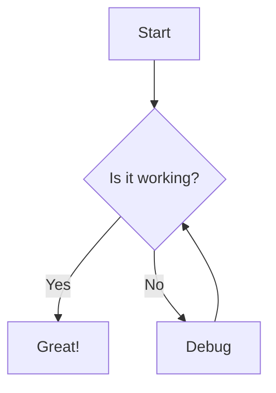

# Usage Guide

This guide will help you get the most out of Aria, your personal AI assistant. Aria provides a feature-rich chat interface with multi-session support, real-time streaming responses, and advanced AI capabilities.

## Getting Started

After [installing](/aria/installation.html) and [configuring](/aria/configuration.html) Aria, you can access it by opening your web browser and navigating to `http://localhost:8000`.


## Basic Features

### Chat Interface

Aria's main interface is a chat window where you can interact with the AI assistant. Here's how to use it:

1. **Start a new chat**: Click the "+ New Chat" button in the sidebar to start a fresh conversation.
2. **Send a message**: Type your message in the input field at the bottom of the screen and press Enter or click the send button.
3. **View responses**: Aria will respond in real-time, with text appearing as it's generated.
4. **Switch between chats**: Click on any previous chat in the sidebar to switch to that conversation.

### Multi-Session Support

Aria allows you to maintain multiple separate conversations:

- Each conversation is saved automatically
- You can name your conversations for easy reference
- All conversations persist even after closing the browser

## Advanced Features

### Markdown & Mermaid Support

Aria supports rich text formatting and diagrams:

- **Markdown**: You can use markdown syntax in your messages for formatting
- **Mermaid Diagrams**: Create diagrams by using Mermaid syntax in code blocks

Example of a Mermaid diagram:

````

````

### AI-Powered Tools

Aria comes with several built-in tools:

#### Web Search

Access real-time information from the web by asking questions that require current information:

```
What are the latest developments in AI?
```

#### Reasoning Engine

Perform complex reasoning and analysis:

```
Can you analyze the pros and cons of using Docker for application deployment?
```

#### YouTube Analysis

Extract insights from YouTube videos by providing a YouTube URL:

```
Can you summarize this video: https://www.youtube.com/watch?v=example
```

#### Weather & Finance Data

Get up-to-date information on weather and financial markets:

```
What's the weather like in New York today?
```

```
What's the current price of Bitcoin?
```

### Prompt Improvement

Aria can help improve your prompts for better AI responses. Click the "Improve Prompt" button (wand icon) next to the input field to enhance your current prompt without changing its meaning.

## Tips for Effective Use

1. **Be specific**: The more specific your questions or instructions, the better Aria can assist you.
2. **Use context**: Aria remembers the conversation history, so you can refer to previous messages.
3. **Try different approaches**: If you don't get the desired response, try rephrasing your question.
4. **Use markdown**: Format your messages using markdown for better readability.
5. **Leverage tools**: Make use of Aria's built-in tools for more powerful assistance.

## Keyboard Shortcuts

| Shortcut          | Action                    |
|-------------------|---------------------------|
| Ctrl/Cmd + K      | Focus message input       |
| Ctrl/Cmd + Shift + L | Toggle theme (light/dark) |
| Escape            | Clear focus               |
| Enter             | Send message              |
| Shift + Enter     | New line in message       |

## Next Steps

- Explore [configuration options](/aria/configuration.html) to customize Aria
- Check out the [advanced features](/aria/advanced.html) for power users
- Learn about [contributing](/aria/contributing.html) to the Aria project
