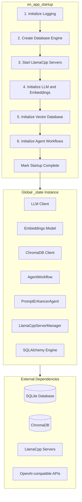
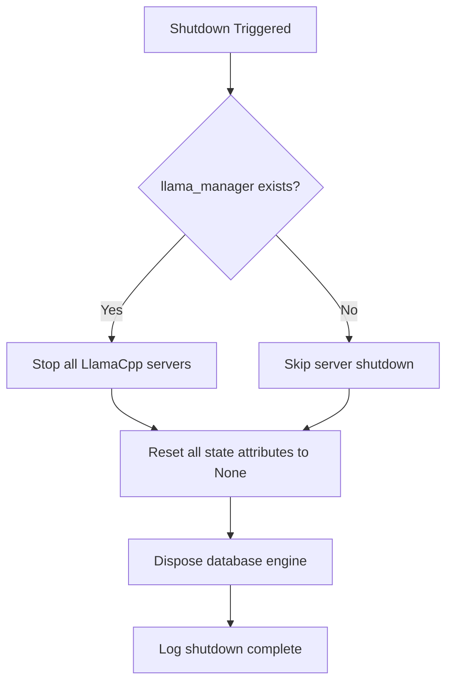

# ARIA Web UI Initialization Process

This document provides a detailed explanation of the initialization process for the ARIA Web UI, including prerequisites, the startup sequence, and potential points of failure.

## Table of Contents

- [Overview](#overview)
- [Architecture](#architecture)
- [Prerequisites](#prerequisites)
- [Startup Sequence](#startup-sequence)
- [AppState Lifecycle](#appstate-lifecycle)
- [Points of Failure](#points-of-failure)
- [Shutdown Process](#shutdown-process)
- [Troubleshooting](#troubleshooting)

---

## Overview

The ARIA Web UI is built on the [Chainlit](https://chainlit.io/) framework and provides a web interface for interacting with LLM agents. The initialization process is managed through the [`on_app_startup()`](src/aria/web_ui.py:329) function, which is triggered by Chainlit's `@cl.on_app_startup` decorator.

The application uses a global state pattern via the [`AppState`](src/aria/web_ui.py:87) dataclass to hold all shared services and resources.

---

## Architecture



---

## Prerequisites

### Environment Variables

The following environment variables must be configured before starting the application:

| Variable | Required | Description | Example |
|----------|----------|-------------|---------|
| `DATA_FOLDER` | Yes | Base data directory path | `data` |
| `ARIA_DB_FILENAME` | Yes | SQLite database filename | `aria.db` |
| `LOCAL_STORAGE_PATH` | Yes | Local storage subdirectory | `storage` |
| `CHROMADB_PERSISTENT_PATH` | Yes | ChromaDB persistence directory | `chromadb` |
| `LLAMA_CPP_BIN_DIR` | Yes | LlamaCpp binaries directory | `bin/llamacpp` |
| `LLAMA_CPP_VERSION` | Yes | LlamaCpp version | `latest` |
| `GGUF_MODELS_DIR` | Yes | Directory for GGUF models | `models` |
| `CHAT_OPENAI_API` | Yes | Chat LLM API endpoint | `http://localhost:7070/v1` |
| `MAX_ITERATIONS` | Yes | Max agent iterations | `100` |
| `TOKEN_LIMIT` | Yes | Memory token limit | `4096` |
| `EMBEDDINGS_API_URL` | Yes | Embeddings API endpoint | `http://localhost:7071/v1` |
| `EMBEDDINGS_MODEL` | Yes | Embeddings model name | `Qwen/Qwen3-Embedding-0.6B-GGUF` |
| `VL_OPENAI_API` | Yes | Vision/Language API endpoint | `http://localhost:7071/v1` |
| `VL_MODEL` | Yes | Vision model name | `ggml-org/granite-docling-258M-GGUF` |
| `CHAINLIT_AUTH_SECRET` | Yes | Secret for Chainlit auth | `your-secret-here` |
| `LLAMA_CONTEXT_SIZE` | No | Context window size | `8192` |
| `HUGGINGFACE_TOKEN` | No | HF token for gated models | `` |

### Directory Structure

The application expects the following directory structure under `DATA_FOLDER`:

```
data/
├── aria.db              # SQLite database (created if not exists)
├── chromadb/            # ChromaDB persistence (created automatically)
├── storage/             # Local file storage for uploads
├── debug.logs           # Application logs
├── llama_servers.json   # Server process state
├── bin/
│   ├── run-model        # Model runner script
│   └── llamacpp/        # LlamaCpp binaries
└── models/              # GGUF model files
```

### External Services

The application requires LlamaCpp inference servers to be available:

| Server | Default Port | Purpose |
|--------|--------------|---------|
| Chat Server | 7070 | Main conversation LLM |
| VL Server | 7071 | Vision/Language model |
| Embeddings Server | 7072 | Text embeddings |

---

## Startup Sequence

The [`on_app_startup()`](src/aria/web_ui.py:329) function executes the following sequence:

### Step 1: Initialize Logging

```python
log_path = DebugConfig.logs_path
logger.add(
    log_path,
    rotation="10 MB",
    level="DEBUG",
    format=LOG_FORMAT,
)
```

**What happens:**
- Configures loguru logger with file output
- Sets up log rotation at 10 MB
- Log path: `{DATA_FOLDER}/debug.logs`

**Failure conditions:**
- Insufficient permissions to write log file
- Invalid log path

---

### Step 2: Create Database Engine

```python
_state.db_engine = create_engine(SQLiteConfig.db_url)
Base.metadata.create_all(_state.db_engine)
```

**What happens:**
- Creates SQLAlchemy engine with SQLite connection
- Creates all database tables defined in [`Base`](src/aria/db/models.py)
- Database file is created if it does not exist

**Configuration used:**
- [`SQLiteConfig.db_url`](src/aria/config/database.py:11) = `sqlite:///{DATA_FOLDER}/{ARIA_DB_FILENAME}`

**Failure conditions:**
- Invalid database path
- Insufficient permissions
- Corrupted database file

---

### Step 3: Start LlamaCpp Servers

```python
_state.llama_manager = LlamaCppServerManager(
    context_size=LlamaCppConfig.context_size
)
_state.llama_manager.start_all()
```

**What happens:**
- Creates a [`LlamaCppServerManager`](src/aria/server/llama.py:43) instance
- Starts three inference servers: Chat, VL, and Embeddings
- Waits for health checks on all servers (blocking)
- Default timeout: 120 seconds per server

**Server startup details:**
- Chat and VL servers use the `run-model` script
- Embeddings server uses `llama-server --embedding` directly
- Process PIDs are saved to `data/llama_servers.json`

**Failure conditions:**
- Missing LlamaCpp binaries
- Missing model files
- Port already in use
- Health check timeout
- Insufficient GPU memory

---

### Step 4: Initialize LLM and Embeddings

```python
_state.llm = get_chat_llm(api_base=ChatConfig.api_url)
_state.embeddings = get_embeddings_model(api_base=EmbeddingsConfig.api_url)
```

**What happens:**
- Creates OpenAI-compatible LLM client pointing to Chat server
- Creates OpenAIEmbedding client pointing to Embeddings server

**Configuration used:**
- [`ChatConfig.api_url`](src/aria/config/models.py:7) = `CHAT_OPENAI_API`
- [`EmbeddingsConfig.api_url`](src/aria/config/models.py:18) = `EMBEDDINGS_API_URL`

**Failure conditions:**
- LLM server not responding
- Invalid API URL
- Model not loaded on server

---

### Step 5: Initialize Vector Database

```python
_state.vector_db = ChromaDBPersistentClient(
    path=ChromaDBConfig.db_path,
    settings=ChromaDBSettings(
        is_persistent=True,
        persist_directory=ChromaDBConfig.db_path.absolute().as_posix(),
        anonymized_telemetry=False,
    ),
)
```

**What happens:**
- Creates a persistent ChromaDB client
- Vector data is stored in `{DATA_FOLDER}/{CHROMADB_PERSISTENT_PATH}`

**Failure conditions:**
- Invalid path
- Insufficient permissions
- ChromaDB corruption

---

### Step 6: Initialize Agent Workflows

```python
from aria.agents import get_prompt_enhancer_agent

_state.agents_workflow = get_agent_workflow(llm=_state.llm)
_state.prompt_enhancer = get_prompt_enhancer_agent(llm=_state.llm)
```

**What happens:**
- Creates the main [`AgentWorkflow`](src/aria/llm.py:6) with multiple agents:
  - Chatter Agent
  - File Editor Agent
  - Market Analyst Agent
  - Python Developer Agent
  - Reasoning Agent
  - Web Researcher Agent
- Creates a separate [`PromptEnhancerAgent`](src/aria/agents/prompt_enhancer.py) for prompt enhancement

**Failure conditions:**
- LLM client not initialized
- Agent configuration errors

---

### Step 7: Mark Startup Complete

```python
_state._startup_complete = True
```

**What happens:**
- Sets the internal flag indicating successful initialization
- This flag is checked by [`AppState.validate()`](src/aria/web_ui.py:157)

---

## AppState Lifecycle

### State Structure

```python
@dataclass
class AppState:
    llm: OpenAI | None = None                    # Required
    embeddings: OpenAIEmbedding | None = None    # Required
    vector_db: ClientAPI | None = None           # Required
    agents_workflow: AgentWorkflow | None = None # Required
    prompt_enhancer: PromptEnhancerAgent | None = None  # Optional
    llama_manager: LlamaCppServerManager | None = None  # Optional
    db_engine: Engine | None = None              # Required
    _startup_complete: bool = field(default=False, repr=False)
```

### Validation

The [`AppState.validate()`](src/aria/web_ui.py:157) method checks that all required attributes are initialized:

```python
def validate(self) -> None:
    missing: list[str] = []
    if self.llm is None:
        missing.append("llm")
    if self.embeddings is None:
        missing.append("embeddings")
    if self.vector_db is None:
        missing.append("vector_db")
    if self.agents_workflow is None:
        missing.append("agents_workflow")
    if self.db_engine is None:
        missing.append("db_engine")
    
    if missing:
        raise AppStateNotInitializedError(...)
```

### Usage Pattern

```python
# Safe attribute access
_state.validate()
handler = _state.agents_workflow.run(...)

# Conditional access
if _state.is_initialized():
    memory = _create_memory(thread_id)
```

---

## Points of Failure

### Critical Failures (App Will Not Start)

| Step | Failure | Symptom | Resolution |
|------|---------|---------|------------|
| Logging | Permission denied | Silent failure or crash | Check directory permissions |
| Database | Cannot create file | Exception at startup | Verify `DATA_FOLDER` exists and is writable |
| LlamaCpp | Missing binaries | `FileNotFoundError` | Install LlamaCpp to `bin/llamacpp` |
| LlamaCpp | Missing models | Server startup failure | Download GGUF models to `models/` |
| LlamaCpp | Port in use | Health check timeout | Kill existing processes on ports 7070-7072 |
| LlamaCpp | GPU OOM | Server crash | Reduce context size or use smaller model |
| LLM | Connection refused | API call failure | Ensure LlamaCpp servers are healthy |
| ChromaDB | Permission denied | Exception at startup | Check `CHROMADB_PERSISTENT_PATH` permissions |

### Non-Critical Failures (Degraded Functionality)

| Component | Failure | Impact | Fallback |
|-----------|---------|--------|----------|
| `prompt_enhancer` | Not initialized | Enhance command unavailable | Original prompt used |
| `llama_manager` | Not initialized | No local inference | External API required |

### Runtime Failures

| Scenario | Error Type | Handling |
|----------|------------|----------|
| AppState not initialized | `AppStateNotInitializedError` | User sees "Please wait a moment and try again" |
| Message processing error | `Exception` | User sees "An error occurred. Please try again." |
| Chat history restore failure | `Exception` | Logged, chat continues with empty memory |
| Authentication failure | `None` return | User sees login error |

---

## Shutdown Process

The [`on_app_shutdown()`](src/aria/web_ui.py:411) function handles graceful shutdown:

```python
@cl.on_app_shutdown
async def on_app_shutdown() -> None:
    logger.info("Shutting down Aria web UI...")
    
    # Stop LlamaCpp servers
    if _state.llama_manager:
        _state.llama_manager.stop_all()
    
    # Reset all state
    _state.llama_manager = None
    _state.llm = None
    _state.embeddings = None
    _state.vector_db = None
    _state.agents_workflow = None
    _state.prompt_enhancer = None
    _state._startup_complete = False
    
    # Dispose database engine
    if _state.db_engine:
        _state.db_engine.dispose()
        _state.db_engine = None
```

### Shutdown Sequence



---

## Troubleshooting

### Common Issues

#### 1. AppStateNotInitializedError

**Symptom:** Users see "The application is not fully initialized" message.

**Causes:**
- Startup failed silently
- Accessing state before startup completes

**Diagnosis:**
```bash
# Check logs for startup errors
cat data/debug.logs | grep -i "failed\|error"
```

**Resolution:**
- Review startup logs
- Verify all prerequisites are met
- Restart the application

---

#### 2. LlamaCpp Server Timeout

**Symptom:** "Starting LlamaCpp inference servers..." hangs indefinitely.

**Causes:**
- Model file missing
- Insufficient GPU memory
- Port already in use

**Diagnosis:**
```bash
# Check if ports are in use
lsof -i :7070 -i :7071 -i :7072

# Check GPU memory
nvidia-smi

# Check model files
ls -la data/models/
```

**Resolution:**
- Kill existing processes on ports
- Free GPU memory
- Download required model files

---

#### 3. Database Errors

**Symptom:** Authentication fails or chat history not persisting.

**Causes:**
- Database file corrupted
- Permission issues
- Missing tables

**Diagnosis:**
```bash
# Check database file
ls -la data/aria.db

# Check integrity
sqlite3 data/aria.db "PRAGMA integrity_check;"
```

**Resolution:**
- Backup and recreate database
- Fix permissions
- Run migrations

---

#### 4. ChromaDB Errors

**Symptom:** Memory/context not working properly.

**Causes:**
- Corrupted vector store
- Permission issues

**Diagnosis:**
```bash
# Check ChromaDB directory
ls -la data/chromadb/
```

**Resolution:**
- Backup and delete ChromaDB directory
- Restart application to recreate

---

### Health Check Endpoints

| Service | Endpoint | Expected Response |
|---------|----------|-------------------|
| Chat Server | `http://localhost:7070/health` | `{"status": "ok"}` |
| VL Server | `http://localhost:7071/health` | `{"status": "ok"}` |
| Embeddings Server | `http://localhost:7072/health` | `{"status": "ok"}` |

---

## Related Files

- [`src/aria/web_ui.py`](src/aria/web_ui.py) - Main web UI module
- [`src/aria/config/api.py`](src/aria/config/api.py) - LlamaCpp configuration
- [`src/aria/config/database.py`](src/aria/config/database.py) - Database configuration
- [`src/aria/config/models.py`](src/aria/config/models.py) - Model configuration
- [`src/aria/server/llama.py`](src/aria/server/llama.py) - LlamaCpp server manager
- [`src/aria/llm.py`](src/aria/llm.py) - LLM and agent workflow initialization
- [`src/aria/db/models.py`](src/aria/db/models.py) - Database models
