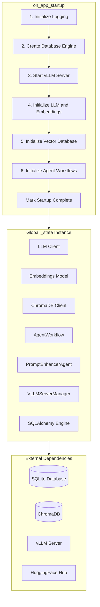
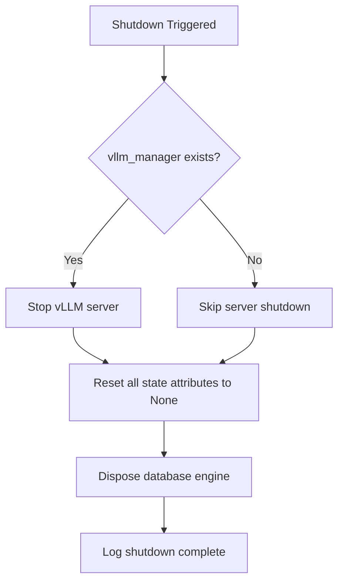

# ARIA Web UI Initialization Process

This document provides a detailed explanation of the initialization process for the ARIA Web UI, including prerequisites, the startup sequence, and potential points of failure.

## Table of Contents

- [Overview](#overview)
- [Architecture](#architecture)
- [Prerequisites](#prerequisites)
- [Startup Sequence](#startup-sequence)
- [AppState Lifecycle](#appstate-lifecycle)
- [Points of Failure](#points-of-failure)
- [Shutdown Process](#shutdown-process)
- [Troubleshooting](#troubleshooting)

---

## Overview

The ARIA Web UI is built on the [Chainlit](https://chainlit.io/) framework and provides a web interface for interacting with LLM agents. The initialization process is managed through the [`on_app_startup()`](src/aria/web_ui.py:329) function, which is triggered by Chainlit's `@cl.on_app_startup` decorator.

The application uses a global state pattern via the [`AppState`](src/aria/web_ui.py:87) dataclass to hold all shared services and resources.

---

## Architecture



---

## Prerequisites

### Environment Variables

The following environment variables must be configured before starting the application:

| Variable | Required | Description | Example |
|----------|----------|-------------|---------|
| `DATA_FOLDER` | Yes | Base data directory path | `data` |
| `ARIA_DB_FILENAME` | Yes | SQLite database filename | `aria.db` |
| `LOCAL_STORAGE_PATH` | Yes | Local storage subdirectory | `storage` |
| `CHROMADB_PERSISTENT_PATH` | Yes | ChromaDB persistence directory | `chromadb` |
| `CHAT_OPENAI_API` | Yes | Chat LLM API endpoint | `http://localhost:9090/v1` |
| `CHAT_MODEL` | Yes | Chat model name | `Granite-4.1-8B` |
| `CHAT_MODEL_PATH` | Yes | HuggingFace model path | `ethanhunt3/Granite-4.1-8B-GPTQ-INT4` |
| `CHAT_CONTEXT_SIZE` | Yes | Chat context window size | `32768` |
| `MAX_ITERATIONS` | Yes | Max agent iterations | `50` |
| `TOKEN_LIMIT_RATIO` | Yes | Memory token limit ratio | `0.80` |
| `EMBEDDINGS_MODEL` | Yes | Embeddings model name | `granite-embedding-311m-multilingual-r2` |
| `EMBED_MODEL_PATH` | Yes | HuggingFace embeddings path | `ibm-granite/granite-embedding-311m-multilingual-r2` |
| `EMBEDDINGS_CONTEXT_SIZE` | Yes | Embeddings context size | `8192` |
| `CHAINLIT_AUTH_SECRET` | Yes | Secret for Chainlit auth | `your-secret-here` |
| `ARIA_VLLM_QUANT` | No | vLLM quantization method | `gptq_marlin` |
| `ARIA_VLLM_GPU_MEMORY_UTILIZATION` | No | GPU memory utilization (auto if unset) | `0.85` |
| `ARIA_VLLM_KV_CACHE_DTYPE` | No | KV cache data type | `fp8` |
| `ARIA_VLLM_TP_SIZE` | No | Tensor parallel size | `1` |
| `ARIA_VLLM_API_KEY` | No | vLLM API key | `sk-aria` |
| `ARIA_VLLM_TOOL_CALL_PARSER` | No | Tool call parser for model family | `granite4` |
| `HUGGINGFACE_TOKEN` | No | HF token for gated models | `` |

### Directory Structure

The application expects the following directory structure under `DATA_FOLDER`:

```
data/
├── aria.db              # SQLite database (created if not exists)
├── chromadb/            # ChromaDB persistence (created automatically)
├── storage/             # Local file storage for uploads
├── debug.logs           # Application logs
├── bin/
│   └── lightpanda/      # Lightpanda headless browser binary
└── models/              # Downloaded model files (optional, vLLM uses HF cache)
```

### External Services

The application uses vLLM for LLM inference and in-process HuggingFace for embeddings:

| Service | Default Port | Purpose |
|---------|--------------|---------|
| vLLM Server | 9090 | Chat LLM inference |
| Embeddings | In-process | Text embeddings (loaded via HuggingFace) |

---

## Startup Sequence

The [`on_app_startup()`](src/aria/web_ui.py:329) function executes the following sequence:

### Step 1: Initialize Logging

```python
log_path = DebugConfig.logs_path
logger.add(
    log_path,
    rotation="10 MB",
    level="DEBUG",
    format=LOG_FORMAT,
)
```

**What happens:**
- Configures loguru logger with file output
- Sets up log rotation at 10 MB
- Log path: `{DATA_FOLDER}/debug.logs`

**Failure conditions:**
- Insufficient permissions to write log file
- Invalid log path

---

### Step 2: Create Database Engine

```python
_state.db_engine = create_engine(SQLiteConfig.db_url)
Base.metadata.create_all(_state.db_engine)
```

**What happens:**
- Creates SQLAlchemy engine with SQLite connection
- Creates all database tables defined in [`Base`](src/aria/db/models.py)
- Database file is created if it does not exist

**Configuration used:**
- [`SQLiteConfig.db_url`](src/aria/config/database.py:11) = `sqlite:///{DATA_FOLDER}/{ARIA_DB_FILENAME}`

**Failure conditions:**
- Invalid database path
- Insufficient permissions
- Corrupted database file

---

### Step 3: Start vLLM Server

```python
_state.vllm_manager = VLLMServerManager()
_state.vllm_manager.start()
```

**What happens:**
- Creates a [`VLLMServerManager`](src/aria/server/vllm.py) instance
- Starts a single vLLM inference server for the chat model
- Auto-detects GPU VRAM and calculates optimal memory utilization
- Applies quantization settings (GPTQ/AWQ) from configuration
- Waits for health check on the vLLM server (blocking)
- Default timeout: 120 seconds

**Server startup details:**
- vLLM is started as a Python subprocess with OpenAI-compatible API
- Default port: 9090
- Model is loaded from HuggingFace Hub (or local cache)
- KV cache dtype is configured (fp8 recommended for 8 GB GPUs)

**Failure conditions:**
- vLLM not installed (`aria vllm install`)
- Missing or invalid model path
- Port already in use
- Health check timeout
- Insufficient GPU memory

---

### Step 4: Initialize LLM and Embeddings

```python
_state.llm = get_chat_llm(api_base=ChatConfig.api_url)
_state.embeddings = get_embeddings_model(api_base=EmbeddingsConfig.api_url)
```

**What happens:**
- Creates OpenAI-compatible LLM client pointing to vLLM server
- Creates HuggingFace embeddings model (loaded in-process)

**Configuration used:**
- `ChatConfig.api_url` = `CHAT_OPENAI_API` (default: `http://localhost:9090/v1`)
- Embeddings loaded directly via `llama-index-embeddings-huggingface`

**Failure conditions:**
- vLLM server not responding
- Invalid API URL
- Model not loaded on server
- Embeddings model download failure

---

### Step 5: Initialize Vector Database

```python
_state.vector_db = ChromaDBPersistentClient(
    path=ChromaDBConfig.db_path,
    settings=ChromaDBSettings(
        is_persistent=True,
        persist_directory=ChromaDBConfig.db_path.absolute().as_posix(),
        anonymized_telemetry=False,
    ),
)
```

**What happens:**
- Creates a persistent ChromaDB client
- Vector data is stored in `{DATA_FOLDER}/{CHROMADB_PERSISTENT_PATH}`

**Failure conditions:**
- Invalid path
- Insufficient permissions
- ChromaDB corruption

---

### Step 6: Initialize Agent Workflows

```python
from aria.agents import get_prompt_enhancer_agent

_state.agents_workflow = get_agent_workflow(llm=_state.llm)
_state.prompt_enhancer = get_prompt_enhancer_agent(llm=_state.llm)
```

**What happens:**
- Creates the main Aria agent via [`AgentWorkflow`](src/aria/agents/aria.py) with a centralized tool registry:
  - **Core tools** (always loaded): reasoning, plan, scratchpad, shell
  - **File tools** (always loaded): read_file, write_file, edit_file, file_info, list_files, search_files, copy_file
  - **Domain tools** (on-demand): browser, development, finance, entertainment, system
- Worker agents can be spawned on-demand via `aria worker spawn` for heavy tasks
- Creates a separate [`PromptEnhancerAgent`](src/aria/agents/prompt_enhancer.py) for prompt enhancement

**Failure conditions:**
- LLM client not initialized
- Agent configuration errors

---

### Step 7: Mark Startup Complete

```python
_state._startup_complete = True
```

**What happens:**
- Sets the internal flag indicating successful initialization
- This flag is checked by [`AppState.validate()`](src/aria/web_ui.py:157)

---

## AppState Lifecycle

### State Structure

```python
@dataclass
class AppState:
    llm: OpenAI | None = None                    # Required
    embeddings: OpenAIEmbedding | None = None    # Required
    vector_db: ClientAPI | None = None           # Required
    agents_workflow: AgentWorkflow | None = None # Required
    prompt_enhancer: PromptEnhancerAgent | None = None  # Optional
    vllm_manager: VLLMServerManager | None = None       # Optional
    db_engine: Engine | None = None              # Required
    _startup_complete: bool = field(default=False, repr=False)
```

### Validation

The [`AppState.validate()`](src/aria/web_ui.py:157) method checks that all required attributes are initialized:

```python
def validate(self) -> None:
    missing: list[str] = []
    if self.llm is None:
        missing.append("llm")
    if self.embeddings is None:
        missing.append("embeddings")
    if self.vector_db is None:
        missing.append("vector_db")
    if self.agents_workflow is None:
        missing.append("agents_workflow")
    if self.db_engine is None:
        missing.append("db_engine")
    
    if missing:
        raise AppStateNotInitializedError(...)
```

### Usage Pattern

```python
# Safe attribute access
_state.validate()
handler = _state.agents_workflow.run(...)

# Conditional access
if _state.is_initialized():
    memory = _create_memory(thread_id)
```

---

## Points of Failure

### Critical Failures (App Will Not Start)

| Step | Failure | Symptom | Resolution |
|------|---------|---------|------------|
| Logging | Permission denied | Silent failure or crash | Check directory permissions |
| Database | Cannot create file | Exception at startup | Verify `DATA_FOLDER` exists and is writable |
| vLLM | Not installed | `ImportError` or startup failure | Run `aria vllm install` |
| vLLM | Missing model | Model download failure | Verify `CHAT_MODEL_PATH` is valid on HuggingFace |
| vLLM | Port in use | Health check timeout | Kill existing process on port 9090 |
| vLLM | GPU OOM | Server crash | Reduce `CHAT_CONTEXT_SIZE` or use smaller model |
| LLM | Connection refused | API call failure | Ensure vLLM server is healthy |
| ChromaDB | Permission denied | Exception at startup | Check `CHROMADB_PERSISTENT_PATH` permissions |

### Non-Critical Failures (Degraded Functionality)

| Component | Failure | Impact | Fallback |
|-----------|---------|--------|----------|
| `prompt_enhancer` | Not initialized | Enhance command unavailable | Original prompt used |
| `vllm_manager` | Not initialized | No local inference | External API required |

### Runtime Failures

| Scenario | Error Type | Handling |
|----------|------------|----------|
| AppState not initialized | `AppStateNotInitializedError` | User sees "Please wait a moment and try again" |
| Message processing error | `Exception` | User sees "An error occurred. Please try again." |
| Chat history restore failure | `Exception` | Logged, chat continues with empty memory |
| Authentication failure | `None` return | User sees login error |

---

## Shutdown Process

The [`on_app_shutdown()`](src/aria/web_ui.py:411) function handles graceful shutdown:

```python
@cl.on_app_shutdown
async def on_app_shutdown() -> None:
    logger.info("Shutting down Aria web UI...")
    
    # Stop vLLM server
    if _state.vllm_manager:
        _state.vllm_manager.stop()
    
    # Reset all state
    _state.vllm_manager = None
    _state.llm = None
    _state.embeddings = None
    _state.vector_db = None
    _state.agents_workflow = None
    _state.prompt_enhancer = None
    _state._startup_complete = False
    
    # Dispose database engine
    if _state.db_engine:
        _state.db_engine.dispose()
        _state.db_engine = None
```

### Shutdown Sequence



---

## Troubleshooting

### Common Issues

#### 1. AppStateNotInitializedError

**Symptom:** Users see "The application is not fully initialized" message.

**Causes:**
- Startup failed silently
- Accessing state before startup completes

**Diagnosis:**
```bash
# Check logs for startup errors
cat data/debug.logs | grep -i "failed\|error"
```

**Resolution:**
- Review startup logs
- Verify all prerequisites are met
- Restart the application

---

#### 2. vLLM Server Timeout

**Symptom:** "Starting vLLM inference server..." hangs indefinitely.

**Causes:**
- Model file not found or invalid
- Insufficient GPU memory
- Port already in use

**Diagnosis:**
```bash
# Check if port is in use
lsof -i :9090

# Check GPU memory
nvidia-smi

# Check vLLM installation
aria vllm status
```

**Resolution:**
- Kill existing processes on port 9090
- Free GPU memory
- Verify model path: `aria vllm info`
- Install vLLM if missing: `aria vllm install`

---

#### 3. Database Errors

**Symptom:** Authentication fails or chat history not persisting.

**Causes:**
- Database file corrupted
- Permission issues
- Missing tables

**Diagnosis:**
```bash
# Check database file
ls -la data/aria.db

# Check integrity
sqlite3 data/aria.db "PRAGMA integrity_check;"
```

**Resolution:**
- Backup and recreate database
- Fix permissions
- Run migrations

---

#### 4. ChromaDB Errors

**Symptom:** Memory/context not working properly.

**Causes:**
- Corrupted vector store
- Permission issues

**Diagnosis:**
```bash
# Check ChromaDB directory
ls -la data/chromadb/
```

**Resolution:**
- Backup and delete ChromaDB directory
- Restart application to recreate

---

### Health Check Endpoints

| Service | Endpoint | Expected Response |
|---------|----------|-------------------|
| vLLM Server | `http://localhost:9090/health` | `{"status": "ok"}` |

---

## Related Files

- [`src/aria/web_ui.py`](src/aria/web_ui.py) - Main web UI module
- [`src/aria/config/api.py`](src/aria/config/api.py) - vLLM and service configuration
- [`src/aria/config/database.py`](src/aria/config/database.py) - Database configuration
- [`src/aria/config/models.py`](src/aria/config/models.py) - Model configuration
- [`src/aria/server/vllm.py`](src/aria/server/vllm.py) - vLLM server manager
- [`src/aria/llm.py`](src/aria/llm.py) - LLM and agent workflow initialization
- [`src/aria/db/models.py`](src/aria/db/models.py) - Database models